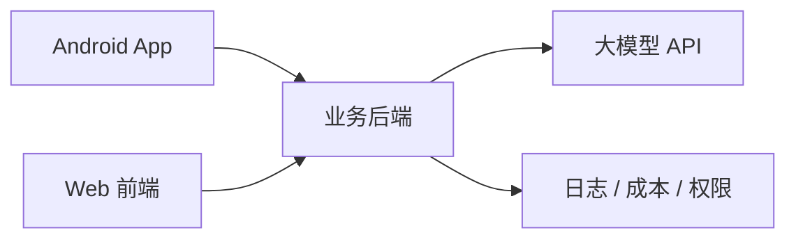
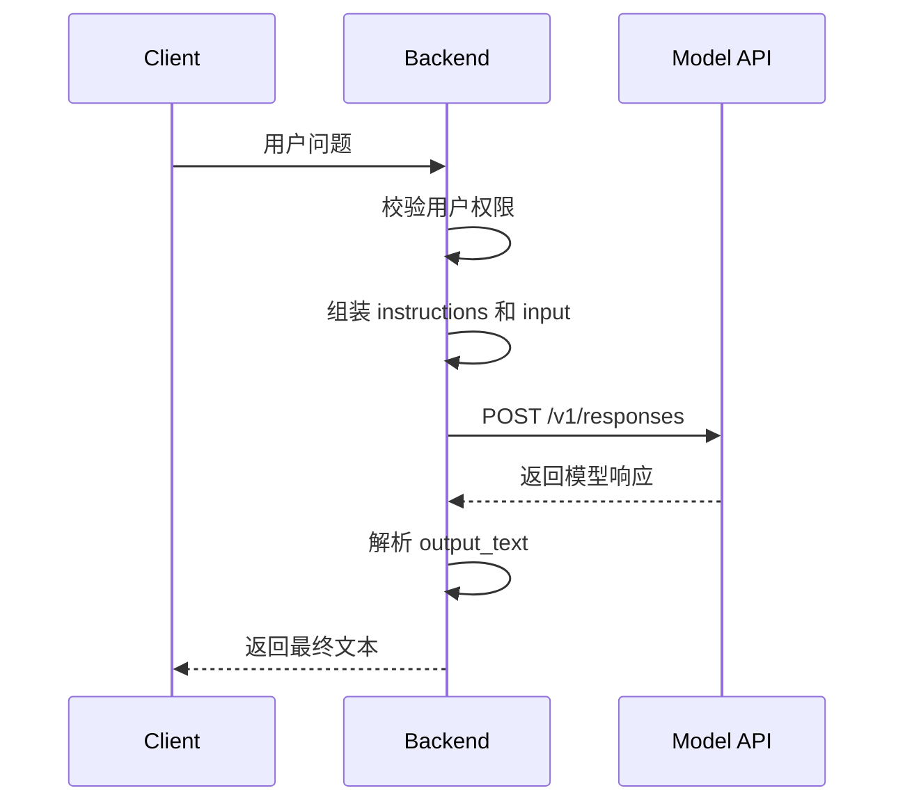

# 01. 大模型 API 调用基础

## 1. 本章目标

本章先讲最小调用链路。你学完后应该知道：

- 一个大模型 API 请求由哪些部分组成。
- 为什么不要在 Android 端直接放 API Key。
- Responses API 和旧式 Chat Completions 的关系。
- 后端代理模型调用时应该承担什么职责。

## 2. 大模型 API 本质上是什么

从开发者角度看，大模型 API 就是一个 HTTP 服务。

你给它：

- 模型名称
- 用户输入
- 系统指令
- 可选参数
- 可选工具或格式约束

它返回：

- 生成文本
- 结构化数据
- 工具调用请求
- 流式事件
- 错误信息

最小请求可以理解为：

```json
{
  "model": "gpt-5.5",
  "input": "用一句话解释 Android ANR"
}
```

最小响应可以理解为：

```json
{
  "output": [
    {
      "type": "message",
      "content": [
        {
          "type": "output_text",
          "text": "Android ANR 是指应用主线程长时间无响应，系统弹出无响应提示。"
        }
      ]
    }
  ]
}
```

实际响应字段会比这个更丰富，但你先抓住主线：输入文本，得到模型输出。

## 3. 推荐架构：客户端不要直连模型

对 Android 或 Web 前端来说，最稳妥的结构是：



不要让 Android 端直接调用模型 API，原因很实际：

- API Key 会被反编译或抓包拿到。
- Prompt 模板无法安全管理。
- 模型成本无法统一控制。
- 调用日志无法统一追踪。
- 用户权限和工具调用权限难以控制。
- 后续接入 RAG、工具调用、Agent 会变复杂。

更合理的做法是：

```text
Android App -> 你的后端接口 -> 大模型 API
```

Android 端只关心用户体验，后端负责安全、上下文、模型调用和日志。

## 4. Responses API、Chat Completions、OpenAI-compatible

### Responses API

Responses API 是当前更推荐的直接模型请求方式，适合文本生成、多模态输入、工具调用、状态化交互和流式事件。

你可以先把它理解为：

```text
统一的大模型请求入口
```

本阶段 Demo 使用 Responses API 风格。

### Chat Completions

Chat Completions 是更早期、更常见的聊天接口形态，很多第三方 OpenAI-compatible 服务仍然支持它。

典型结构是：

```json
{
  "model": "xxx",
  "messages": [
    {"role": "system", "content": "你是助手"},
    {"role": "user", "content": "你好"}
  ]
}
```

你仍然会在很多资料、旧项目和第三方模型服务里看到它。

### OpenAI-compatible API

OpenAI-compatible 指的是某些模型服务模仿 OpenAI 的接口风格，让你可以通过类似的请求格式调用不同厂商或本地模型。

注意一点：很多服务只兼容 Chat Completions，不一定兼容 Responses API。实际接入时要看目标服务支持哪种端点。

## 5. 一个 API 请求通常包含什么

基础字段：

| 字段 | 作用 |
| --- | --- |
| `model` | 指定模型 |
| `input` | 用户输入或消息列表 |
| `instructions` | 高优先级指令，控制模型行为 |
| `stream` | 是否启用流式输出 |
| `max_output_tokens` | 限制最大输出长度 |

后续阶段会接触更多字段：

- `tools`
- `text.format`
- `reasoning`
- `previous_response_id`
- `metadata`

现在先把基础字段用熟。

## 6. 最小调用流程



## 7. 对 Android 开发者的理解方式

你可以把大模型 API 当成一个特殊的远程服务：

- Retrofit / OkHttp 可以调用它。
- 但不建议 App 直接调。
- 后端代理接口更像你熟悉的业务 API。
- Android 端只消费你后端返回的稳定格式。

推荐后端返回给 Android 的格式：

```json
{
  "request_id": "req_xxx",
  "answer": "分析结果文本",
  "usage": {
    "input_tokens": 123,
    "output_tokens": 80
  }
}
```

Android 端不要直接依赖模型厂商的原始响应结构，否则以后换模型会很痛。

## 8. 本章小结

阶段二的核心不是背 API 参数，而是建立调用边界：

```text
客户端负责体验
后端负责安全和编排
模型 API 负责生成
日志系统负责追踪和复盘
```

下一章会继续讲请求、响应和上下文怎么组织。
