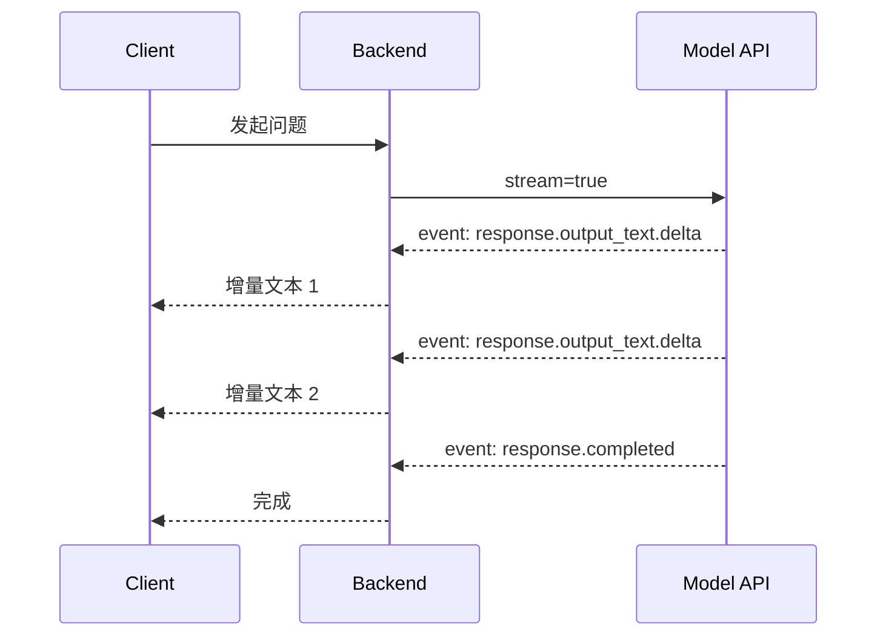

# 03. 流式输出、错误处理与工程注意点

## 1. 为什么需要流式输出

模型生成长文本时，如果等完整结果生成完再返回，用户会感觉很慢。

流式输出可以让用户更早看到内容：

```text
非流式：等待完整生成 -> 一次性显示
流式：边生成 -> 边显示
```

在 Android 或 Web Chat UI 中，流式输出非常重要。它不一定让总耗时变短，但会明显改善体感速度。

## 2. SSE 是什么

SSE 是 Server-Sent Events，服务端可以通过一个 HTTP 连接持续向客户端推送事件。

大模型流式输出通常会这样工作：



对于 Responses API，流式事件是带类型的。你应该根据事件 `type` 分支处理，而不是把所有事件都当文本。

## 3. 后端如何转发流式输出

推荐结构：

```text
Android / Web
  -> 你的后端 SSE 接口
      -> 模型 API stream=true
```

不要让 Android 直接连模型 API。后端转发时可以做这些事：

- 隐藏 API Key
- 记录 request ID
- 统计 Token
- 检查用户权限
- 屏蔽敏感内容
- 在模型失败时返回统一错误
- 控制是否允许中途取消

## 4. Android 端如何理解流式输出

Android 端可以把流式输出理解为“不断追加文本”的 UI 状态。

一个典型状态机：

```text
Idle -> Loading -> Streaming -> Completed
                    -> Failed
                    -> Cancelled
```

UI 层需要考虑：

- 第一段内容到达前显示加载状态。
- 增量文本到达后追加到当前消息。
- 完成事件到达后关闭 loading。
- 失败事件到达后显示可重试状态。
- 用户离开页面时取消请求。

## 5. 常见错误类型

### 401 / 403

通常是认证或权限问题。

检查：

- API Key 是否正确。
- Key 是否有访问该模型的权限。
- 后端是否把 Key 暴露给了客户端。

### 429

通常是限流。

处理方式：

- 指数退避重试。
- 降低并发。
- 对用户做排队提示。
- 建立缓存。
- 区分用户级限流和系统级限流。

### 400

通常是请求结构错误。

检查：

- 参数名是否正确。
- 模型是否支持该参数。
- JSON Schema 是否合法。
- 输入是否超过上下文限制。

### 5xx

通常是服务端或供应商短暂问题。

处理方式：

- 短暂重试。
- 切换备用模型。
- 给用户明确失败提示。
- 记录请求 ID 方便排查。

## 6. 超时与重试

大模型请求比普通接口更容易慢，所以要明确设置超时。

建议拆成三类：

| 类型 | 示例 |
| --- | --- |
| 连接超时 | 5 到 10 秒 |
| 首 Token 超时 | 15 到 30 秒 |
| 总生成超时 | 根据业务控制，比如 60 到 180 秒 |

重试要谨慎。不是所有请求都适合重试。

适合重试：

- 网络抖动
- 429 限流
- 5xx 临时错误

不适合盲目重试：

- 已经执行副作用工具调用
- 用户明确取消
- 请求参数错误
- 可能重复扣费或重复下单的任务

## 7. 日志与 Trace

上线前至少记录：

- 用户 ID 或匿名 ID
- 业务场景
- 模型名称
- 请求开始时间和结束时间
- 是否流式
- 错误码
- request ID
- Token 使用量
- Prompt 版本

不要直接记录完整敏感内容。对手机号、身份证、Token、地址等敏感字段要脱敏。

日志不是为了“多存点”，而是为了回答这些问题：

- 哪些场景最慢？
- 哪些错误最多？
- 哪个 Prompt 版本效果变差？
- 哪些用户成本异常？
- 某次错误能不能复盘？

## 8. Android 场景中的工程注意点

Android 端接入流式输出时要注意：

- 页面销毁时取消请求。
- 避免在主线程做大量字符串拼接。
- 弱网下支持重试或继续。
- App 进入后台时决定是否继续生成。
- 语音播放和文本生成要处理状态冲突。
- 不要把 API Key、完整 Prompt、内部工具参数放进 App。

如果要做语音助手，链路会变成：

```text
用户语音 -> ASR -> 后端 -> LLM 流式生成 -> TTS -> 播放
```

这里的延迟来源更多，后续多模态阶段再展开。

## 9. 本章小结

流式输出和错误处理决定了大模型应用是否像一个真正产品。

你需要记住：

```text
流式输出提升体感速度
错误处理保证稳定性
日志和 Trace 保证可排查
权限和脱敏保证安全
```

下一章会运行一个最小 Demo，把本阶段内容串起来。
