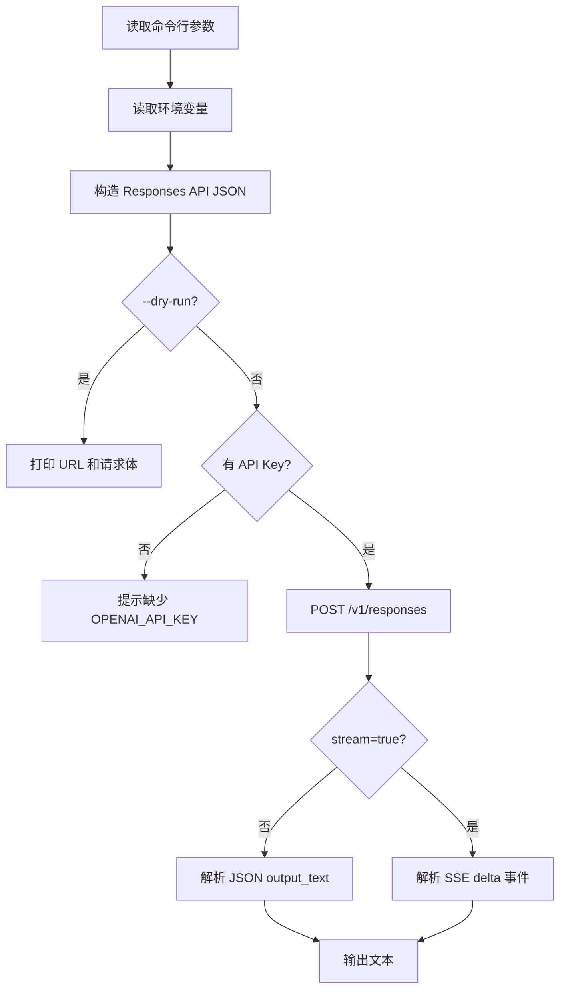

# 04. Demo：OpenAI-compatible CLI

本章配套一个 Python CLI Demo，位置：

```text
大模型技术学习教程/02-大模型API基础/demo/openai_compatible_cli.py
```

这个 Demo 使用 Python 标准库实现，不依赖第三方包。它的目的不是封装完整 SDK，而是帮助你看清楚大模型 API 调用的核心过程。

## 1. Demo 能做什么

它支持：

- 构造 Responses API 请求体。
- 普通非流式请求。
- SSE 流式输出。
- 从环境变量读取 API Key。
- 通过 `--dry-run` 查看请求 URL 和 JSON，不真正发请求。
- 通过单元测试验证请求构造和流式解析。

## 2. 文件结构

```text
demo/
  openai_compatible_cli.py
  .env.example
  tests/
    test_openai_compatible_cli.py
```

## 3. 不带 API Key 先看请求体

在当前仓库根目录运行：

```powershell
python ".\大模型技术学习教程\02-大模型API基础\demo\openai_compatible_cli.py" `
  --prompt "用一句话解释 Android ANR" `
  --instructions "你是 Android 稳定性分析助手。" `
  --dry-run
```

你会看到类似输出：

```json
{
  "url": "https://api.openai.com/v1/responses",
  "payload": {
    "model": "gpt-5.5",
    "input": "用一句话解释 Android ANR",
    "stream": false,
    "instructions": "你是 Android 稳定性分析助手。"
  }
}
```

这个命令不会请求真实 API，适合学习请求结构。

## 4. 设置环境变量

PowerShell 示例：

```powershell
$env:OPENAI_API_KEY="你的 API Key"
$env:OPENAI_MODEL="gpt-5.5"
$env:OPENAI_BASE_URL="https://api.openai.com/v1"
```

如果你使用其他兼容服务，把 `OPENAI_BASE_URL` 改成对应服务地址。注意：不是所有 OpenAI-compatible 服务都支持 Responses API。

## 5. 普通请求

```powershell
python ".\大模型技术学习教程\02-大模型API基础\demo\openai_compatible_cli.py" `
  --prompt "用三点解释 Android ANR 的常见原因" `
  --instructions "你是 Android 稳定性分析助手，回答要简洁。"
```

## 6. 流式请求

```powershell
python ".\大模型技术学习教程\02-大模型API基础\demo\openai_compatible_cli.py" `
  --prompt "生成一个 Android 崩溃日志分析步骤清单" `
  --instructions "你是 Android 稳定性分析助手。" `
  --stream
```

流式请求会边生成边打印文本。Demo 只处理 `response.output_text.delta` 事件，真实项目里还应该处理完成、失败、工具调用等更多事件。

## 7. 运行测试

```powershell
python -m unittest discover -s ".\大模型技术学习教程\02-大模型API基础\demo\tests"
```

测试覆盖：

- 请求体是否正确构造。
- `instructions` 是否正确加入。
- 普通响应文本是否能提取。
- SSE typed events 是否能解析为增量文本。

## 8. Demo 代码核心流程



## 9. 和真实项目的差距

这个 Demo 为了学习保持简单，真实项目还需要补：

- 后端鉴权
- 用户权限控制
- Prompt 版本管理
- Token 统计
- request ID 日志
- 重试和限流
- 敏感信息脱敏
- Android / Web 的流式 UI

## 10. 本阶段小结

阶段二学完后，你应该已经具备最小 API 调用能力：

```text
会构造请求
会发送请求
会解析响应
会处理流式输出
知道 API Key 应该放在后端
知道 Demo 和生产系统还差哪些工程能力
```

下一阶段可以进入 Prompt Engineering，开始学习如何让模型稳定完成具体任务。
