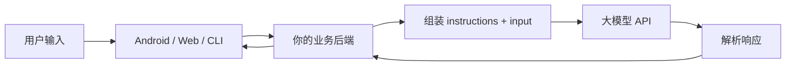

# 阶段二：大模型 API 基础

本阶段目标是让你从“知道大模型是什么”进入“能从程序里稳定调用大模型”。这一阶段不追求复杂 Agent，也不做 RAG，先把 API 调用、请求结构、响应解析、流式输出、错误处理这些地基打稳。

## 本阶段你会学到什么

1. 大模型 API 的基本调用流程。
2. 为什么推荐把 API Key 放在后端，而不是 Android 或前端。
3. Responses API、Chat Completions、OpenAI-compatible API 的区别。
4. 如何组织 `model`、`input`、`instructions` 等基础参数。
5. 如何处理普通响应和流式响应。
6. 如何处理超时、重试、限流和日志追踪。
7. 如何运行一个最小 Python Demo。

## 章节目录

1. [大模型 API 调用基础](./01-大模型API调用基础.md)
2. [请求、响应与上下文管理](./02-请求响应与上下文管理.md)
3. [流式输出、错误处理与工程注意点](./03-流式输出错误处理与工程注意点.md)
4. [Demo：OpenAI-compatible CLI](./04-Demo-OpenAI-compatible-CLI.md)

## 推荐学习顺序

先读前三篇，再运行 Demo。Demo 的目标不是做完整产品，而是帮你看清楚：

```text
程序如何构造请求 -> 如何发送给模型 -> 如何解析普通响应 -> 如何处理流式响应
```

## API 调用总览图



阶段二只关注这条链路中的基础调用部分。后面的 RAG、Tool Calling、Agent 都是在这条链路上继续加能力。

## 官方资料

- [OpenAI Text generation](https://developers.openai.com/api/docs/guides/text)
- [OpenAI Streaming responses](https://developers.openai.com/api/docs/guides/streaming-responses)
- [OpenAI API reference overview](https://developers.openai.com/api/reference/overview)
- [OpenAI Models](https://developers.openai.com/api/docs/models)
