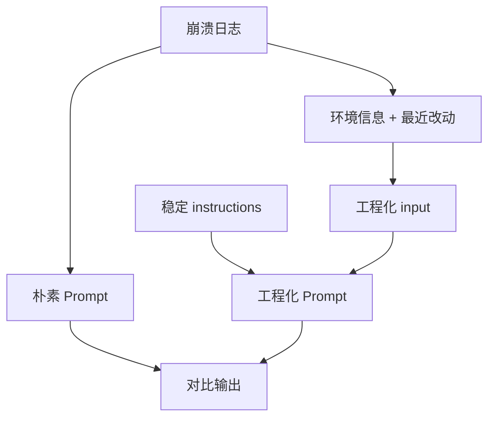

# 04. Prompt 测试、版本管理与 Demo

## 1. 为什么 Prompt 也要测试

Prompt 一改，模型行为就可能变化。

常见问题：

- 输出格式变了。
- 变得更啰嗦。
- 开始编造信息。
- 忽略了某条约束。
- 对某些边界输入退化。

所以 Prompt 应该像代码一样测试。

## 2. Prompt 版本管理

建议给每个业务 Prompt 一个版本号：

```text
android_crash_analysis_v1
android_crash_analysis_v2
code_review_v1
test_generation_v1
```

版本号应该进入日志：

```json
{
  "trace_id": "trace_001",
  "prompt_version": "android_crash_analysis_v1",
  "model": "gpt-5.5",
  "latency_ms": 3200
}
```

这样线上出问题时，你能知道是哪版 Prompt 产生的结果。

## 3. Prompt 测试分三层

### 第一层：模板结构测试

检查 Prompt 是否包含必要规则。

例如：

- 是否包含“不确定”处理。
- 是否包含输出字段。
- 是否用标签包裹用户输入。
- 是否把稳定规则放在 `instructions`。

本阶段 Demo 就包含这类测试。

### 第二层：样例输出测试

准备一些固定输入，调用模型，看输出是否满足预期。

例如：

- NPE 日志能否识别空指针。
- ANR 日志能否识别主线程阻塞。
- 信息不足时是否回答不确定。

这类测试会消耗 API 调用，适合在本地手动或 CI 的小样本集合中运行。

### 第三层：评估集

当应用变复杂后，需要建立评估集。

评估维度：

- 准确性
- 是否引用证据
- 是否编造
- 输出格式是否合规
- 是否给出可执行建议

## 4. 本阶段 Demo

Demo 位置：

```text
大模型技术学习教程/03-PromptEngineering/demo/prompt_builder.py
```

它不会真实请求 API，而是生成“朴素 Prompt”和“工程化 Prompt”的请求体，方便你对比。

## 5. 运行 Demo

PowerShell 示例：

```powershell
python ".\大模型技术学习教程\03-PromptEngineering\demo\prompt_builder.py" `
  --crash-log "FATAL EXCEPTION: main`njava.lang.NullPointerException`nat com.example.MainActivity.onCreate(MainActivity.kt:20)" `
  --app-version "1.2.0" `
  --android-version "14" `
  --device "Pixel 8" `
  --recent-changes "登录页读取缓存逻辑调整" `
  --mode compare
```

输出会包含两份请求体：

- `naive`：朴素 Prompt。
- `engineered`：工程化 Prompt，包含 `instructions` 和结构化 `input`。

## 6. 从文件读取崩溃日志

如果日志很长，可以写到文件里，然后用 `@path` 读取：

```powershell
python ".\大模型技术学习教程\03-PromptEngineering\demo\prompt_builder.py" `
  --crash-log "@.\crash.log" `
  --mode engineered
```

## 7. 运行测试

```powershell
python -m unittest discover -s ".\大模型技术学习教程\03-PromptEngineering\demo\tests"
```

测试覆盖：

- `instructions` 是否包含角色、输出契约和不确定处理。
- 动态输入是否用 `<crash_log>` 标签包裹。
- 是否能生成 Responses API 请求体。
- 朴素 Prompt 和工程化 Prompt 是否能对比。

## 8. Demo 流程图



## 9. 本阶段小结

学完阶段三后，你应该能做到：

```text
把业务需求拆成稳定规则和动态输入
用清晰边界包裹用户数据
为 Prompt 定义输出契约
用测试保护 Prompt 模板
为后续结构化输出和 RAG 打基础
```

下一阶段建议进入“结构化输出与 Function Calling”。那一阶段会把自然语言输出升级成程序可校验的 JSON，并让模型开始调用工具。
