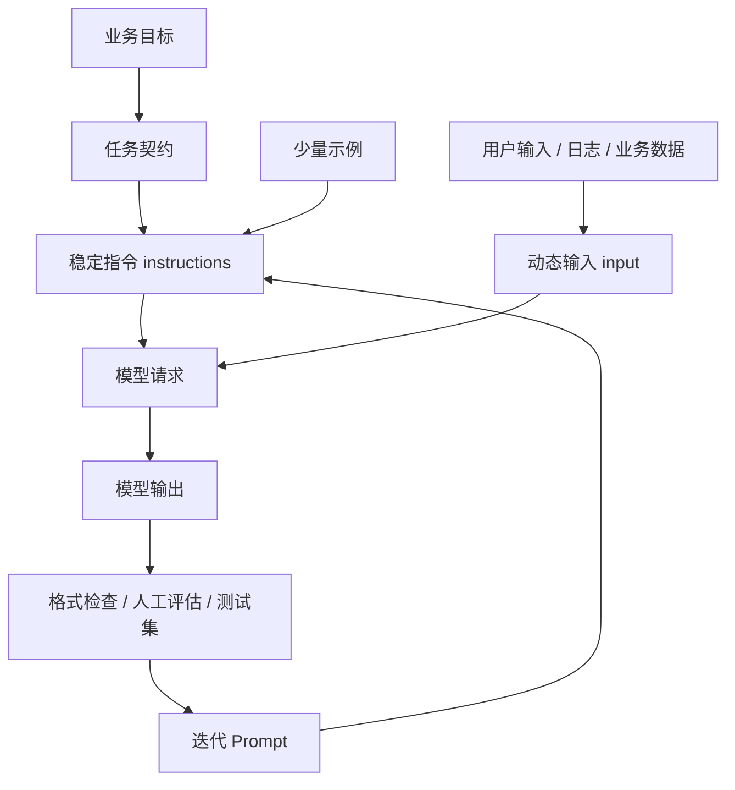

# 阶段三：Prompt Engineering

本阶段目标是让你从“能调用模型”进入“能稳定地让模型完成任务”。Prompt Engineering 不是写几句神奇咒语，而是把业务目标、输入数据、约束条件和输出要求组织成模型容易理解、程序容易维护、结果容易测试的结构。

## 本阶段你会学到什么

1. Prompt 为什么会影响模型输出质量。
2. `instructions`、`input`、角色、上下文、示例分别放什么。
3. 如何设计可维护的 Prompt 模板。
4. 如何用 Markdown 和 XML 标签划分输入边界。
5. 如何为 Android 崩溃日志分析设计 Prompt。
6. 如何把 Prompt 当作代码进行版本管理和测试。
7. 如何运行一个 Prompt 对比 Demo。

## 章节目录

1. [Prompt Engineering 基础](./01-PromptEngineering基础.md)
2. [Prompt 模板设计方法](./02-Prompt模板设计方法.md)
3. [Android 场景 Prompt 实战](./03-Android场景Prompt实战.md)
4. [Prompt 测试、版本管理与 Demo](./04-Prompt测试版本管理与Demo.md)

## 本阶段核心图

## 官方资料

- [OpenAI Prompting](https://developers.openai.com/api/docs/guides/prompting)
- [OpenAI Prompt engineering](https://developers.openai.com/api/docs/guides/prompt-engineering)
- [OpenAI Reasoning best practices](https://developers.openai.com/api/docs/guides/reasoning-best-practices)
- [OpenAI Structured Outputs](https://developers.openai.com/api/docs/guides/structured-outputs)
