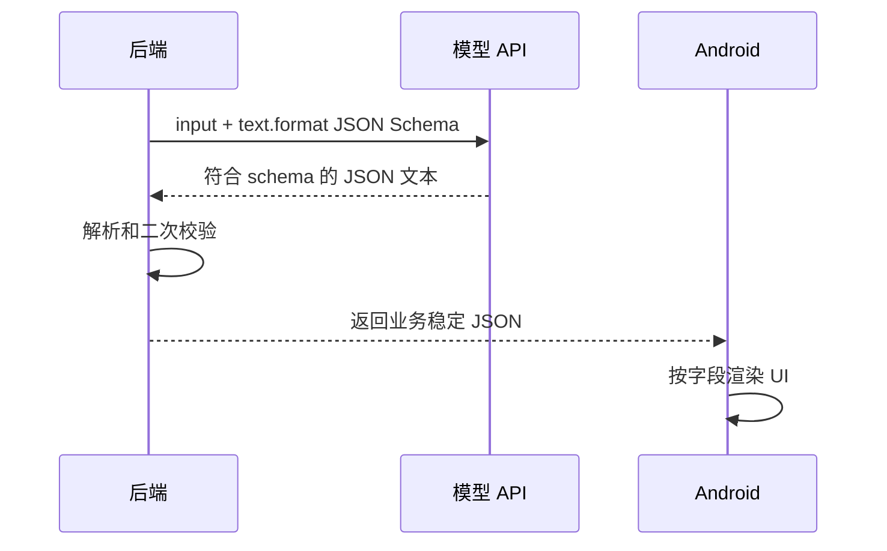

# 01. 结构化输出基础

## 1. 为什么需要结构化输出

前三个阶段里，模型主要输出自然语言。自然语言适合给人看，但不适合程序稳定处理。

例如 Android 崩溃分析，如果模型返回：

```text
这个问题大概率是空指针，建议检查 MainActivity 的 onCreate。
```

人能看懂，但程序很难稳定提取：

- 问题类型
- 严重程度
- 证据列表
- 修复建议
- 是否需要更多信息

如果你要把结果展示在 Android 页面、保存到数据库、做统计、做自动评估，就需要结构化输出。

## 2. “请输出 JSON”有什么问题

只在 Prompt 里写：

```text
请用 JSON 输出。
```

通常不够稳定。模型可能：

- 少字段
- 多字段
- 字段名变化
- enum 值不一致
- 输出 Markdown 代码块
- 在 JSON 前后加解释文字

这会导致后端解析失败，或者 Android 端拿不到稳定字段。

## 3. Structured Outputs 是什么

Structured Outputs 是通过 JSON Schema 约束模型输出的一种能力。你告诉模型必须按某个 schema 返回，模型生成的响应会更适合程序处理。

核心结构可以理解为：

```json
{
  "text": {
    "format": {
      "type": "json_schema",
      "name": "android_crash_analysis",
      "strict": true,
      "schema": {}
    }
  }
}
```

这里最关键的是：

- `type: "json_schema"`：使用 JSON Schema。
- `name`：这个结构化结果的名字。
- `strict: true`：要求严格遵守 schema。
- `schema`：字段定义。

## 4. Structured Outputs 和 JSON mode

JSON mode 只能保证输出是合法 JSON，但不能保证字段符合你的 schema。

Structured Outputs 不只要求合法 JSON，还要求符合 schema。

简单理解：

| 能力 | 保证合法 JSON | 保证字段符合 schema |
| --- | --- | --- |
| JSON mode | 是 | 否 |
| Structured Outputs | 是 | 是 |

如果模型和接口支持，优先使用 Structured Outputs。

## 5. 什么时候用结构化输出

适合：

- 分类结果
- 信息抽取
- 风险评级
- 表单填充
- Android UI 展示字段
- 自动测试和评估
- 后端持久化结果

不适合：

- 完全开放的长文创作
- 用户只需要自然语言解释
- 输出结构不稳定且没有消费方

## 6. Android 场景中的价值

假设后端返回给 Android：

```json
{
  "issue_type": "NullPointerException",
  "severity": "high",
  "summary": "MainActivity.onCreate 中访问了空对象。",
  "evidence": ["java.lang.NullPointerException", "MainActivity.onCreate"],
  "likely_causes": ["对象未初始化"],
  "fix_suggestions": ["增加空值检查", "确认初始化时机"],
  "needs_more_info": []
}
```

Android 端就可以稳定展示：

- 顶部风险等级
- 关键证据列表
- 修复建议列表
- “需要补充信息”区域

而不是解析一大段 Markdown。

## 7. 结构化输出流程图



## 8. 本章小结

结构化输出的核心价值是：

```text
把模型输出从“给人读的文本”，变成“程序可以稳定处理的数据”。
```

下一章会把 Android 崩溃分析结果设计成一个 JSON Schema。
