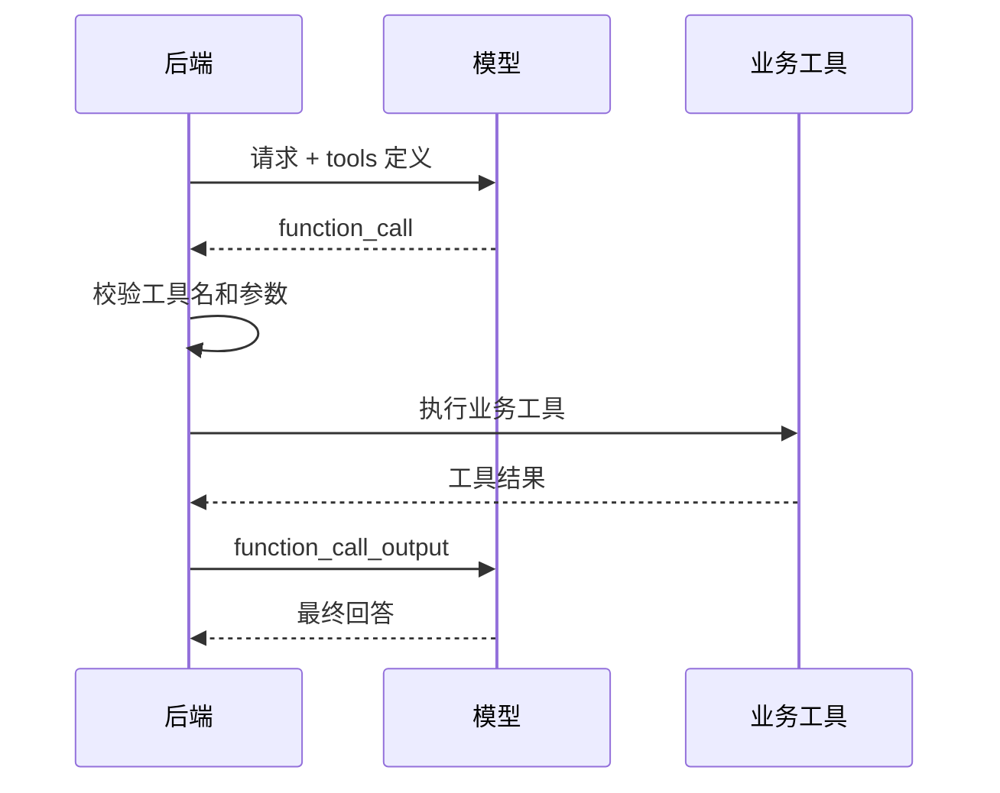

# 03. Function Calling 工具调用基础

## 1. Function Calling 解决什么问题

模型自己不能直接访问你的数据库、文件系统、Android 设备、内部接口或业务服务。

Function Calling 的作用是：让模型在需要外部能力时，生成一个结构化的工具调用请求，由你的程序决定是否执行。

例如用户问：

```text
这个 NullPointerException 以前出现过吗？
```

模型可以请求调用：

```json
{
  "type": "function_call",
  "name": "search_known_android_issues",
  "arguments": "{\"keyword\":\"NullPointerException\"}"
}
```

然后后端执行真实查询，把结果再交给模型。

## 2. 工具不是模型直接执行

这是最重要的一点：

```text
模型只提出工具调用请求。
你的程序负责检查、授权、执行和回传结果。
```

模型不能绕过你的后端直接调用数据库。

## 3. 工具调用五步流程



## 4. 工具定义包括什么

一个函数工具通常包括：

- `type`
- `name`
- `description`
- `parameters`
- `strict`

示例：

```json
{
  "type": "function",
  "name": "search_known_android_issues",
  "description": "Search a small local Android crash and ANR knowledge base by keyword.",
  "strict": true,
  "parameters": {
    "type": "object",
    "properties": {
      "keyword": {
        "type": "string",
        "description": "Exception or symptom keyword."
      }
    },
    "required": ["keyword"],
    "additionalProperties": false
  }
}
```

`description` 很重要。它会影响模型什么时候选择这个工具。

## 5. 工具调用输出

工具执行后，后端要构造 `function_call_output`。

核心字段：

```json
{
  "type": "function_call_output",
  "call_id": "call_123",
  "output": "{\"matches\":[]}"
}
```

`call_id` 用来把工具结果和模型刚才的调用请求对应起来。

## 6. 工具权限控制

Function Calling 不是“模型想调什么就调什么”。

后端必须控制：

- 当前用户能不能调用这个工具。
- 参数是否合法。
- 这个工具有没有副作用。
- 是否需要人工确认。
- 是否需要脱敏。
- 是否要限制调用频率。

例如：

| 工具 | 是否需要人工确认 |
| --- | --- |
| 查询崩溃知识库 | 不需要 |
| 查询用户订单 | 需要鉴权 |
| 删除数据 | 必须人工确认 |
| 发送通知 | 通常需要确认 |

## 7. Android 场景工具示例

适合 Android 大模型助手的工具：

- `search_known_android_issues`
- `read_recent_crash_logs`
- `query_app_version_info`
- `search_project_docs`
- `get_git_diff_summary`
- `create_bug_report_draft`

不建议一开始就开放高风险工具：

- 自动提交代码
- 自动删除数据
- 自动发送线上通知
- 自动改生产配置

## 8. Function Calling 和 Agent 的关系

Function Calling 是模型调用工具的机制。

Agent 是围绕工具调用做多步骤规划、执行、观察和继续决策的工作流。

可以理解为：

```text
Function Calling 是一次工具调用能力。
Agent 是多次工具调用和任务规划的组合。
```

## 9. 本章小结

Function Calling 的核心边界：

```text
模型决定“可能需要什么工具”
后端决定“能不能执行”
业务系统负责“真正执行”
模型负责“结合结果继续回答”
```

下一章会运行 Demo，分别生成结构化输出 payload 和工具调用 payload。
