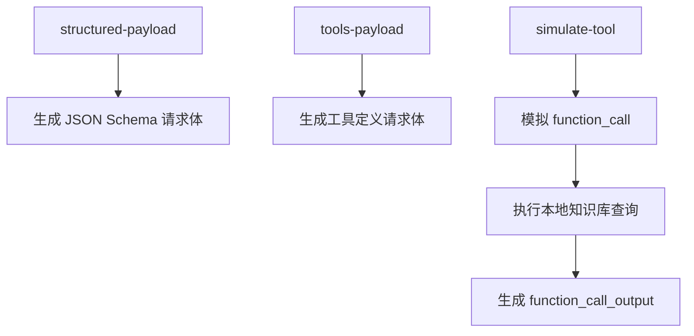

# 04. Demo：结构化输出与工具调用

本阶段 Demo 位置：

```text
大模型技术学习教程/04-结构化输出与FunctionCalling/demo/structured_tools_demo.py
```

这个 Demo 使用 Python 标准库实现，不真实请求 API。它用于学习：

- 如何构造 Structured Outputs 请求体。
- 如何定义函数工具。
- 如何解析模型返回的 `function_call`。
- 如何执行本地工具并生成 `function_call_output`。

## 1. 文件结构

```text
demo/
  structured_tools_demo.py
  tests/
    test_structured_tools_demo.py
```

## 2. 打印 Android 崩溃分析 JSON Schema

```powershell
python ".\大模型技术学习教程\04-结构化输出与FunctionCalling\demo\structured_tools_demo.py" schema
```

你会看到 `issue_type`、`severity`、`summary`、`evidence` 等字段定义。

## 3. 生成结构化输出请求体

```powershell
python ".\大模型技术学习教程\04-结构化输出与FunctionCalling\demo\structured_tools_demo.py" `
  structured-payload `
  --crash-log "java.lang.NullPointerException at com.example.MainActivity.onCreate" `
  --app-version "1.2.0"
```

输出里会包含：

```json
{
  "text": {
    "format": {
      "type": "json_schema",
      "name": "android_crash_analysis",
      "strict": true,
      "schema": {}
    }
  }
}
```

这就是告诉模型：最终回答必须符合这个 JSON Schema。

## 4. 生成工具调用请求体

```powershell
python ".\大模型技术学习教程\04-结构化输出与FunctionCalling\demo\structured_tools_demo.py" `
  tools-payload `
  --question "这个 NullPointerException 以前出现过吗？"
```

输出里会包含一个函数工具：

```json
{
  "type": "function",
  "name": "search_known_android_issues",
  "strict": true,
  "parameters": {}
}
```

真实请求中，模型可以选择是否调用它。

## 5. 模拟工具调用执行

```powershell
python ".\大模型技术学习教程\04-结构化输出与FunctionCalling\demo\structured_tools_demo.py" `
  simulate-tool `
  --keyword "NullPointerException"
```

这个命令会模拟：

```text
模型返回 function_call
  -> 后端解析参数
  -> 后端执行本地 search_known_android_issues
  -> 后端生成 function_call_output
```

## 6. 运行测试

```powershell
python -m unittest discover -s ".\大模型技术学习教程\04-结构化输出与FunctionCalling\demo\tests"
```

测试覆盖：

- Android 崩溃分析 schema 的必填字段。
- Responses API `text.format` 请求体。
- 结构化结果的简易校验。
- 函数工具定义。
- `function_call` 解析。
- `function_call_output` 生成。

## 7. Demo 流程图



## 8. 和真实项目的差距

真实项目还需要：

- 调用真实 Responses API。
- 处理多个工具调用。
- 校验所有工具参数。
- 做用户权限控制。
- 对副作用工具加人工确认。
- 记录 trace ID。
- 处理工具失败和超时。
- 把最终结果转成 Android / Web 需要的业务格式。

## 9. 本阶段小结

学完第四阶段后，你应该能区分：

```text
结构化输出：让模型最终回答符合 schema。
Function Calling：让模型请求你的系统执行工具。
```

下一阶段建议进入“模型选型与成本评估”，开始学习怎么根据任务选择合适模型、控制成本和延迟。
