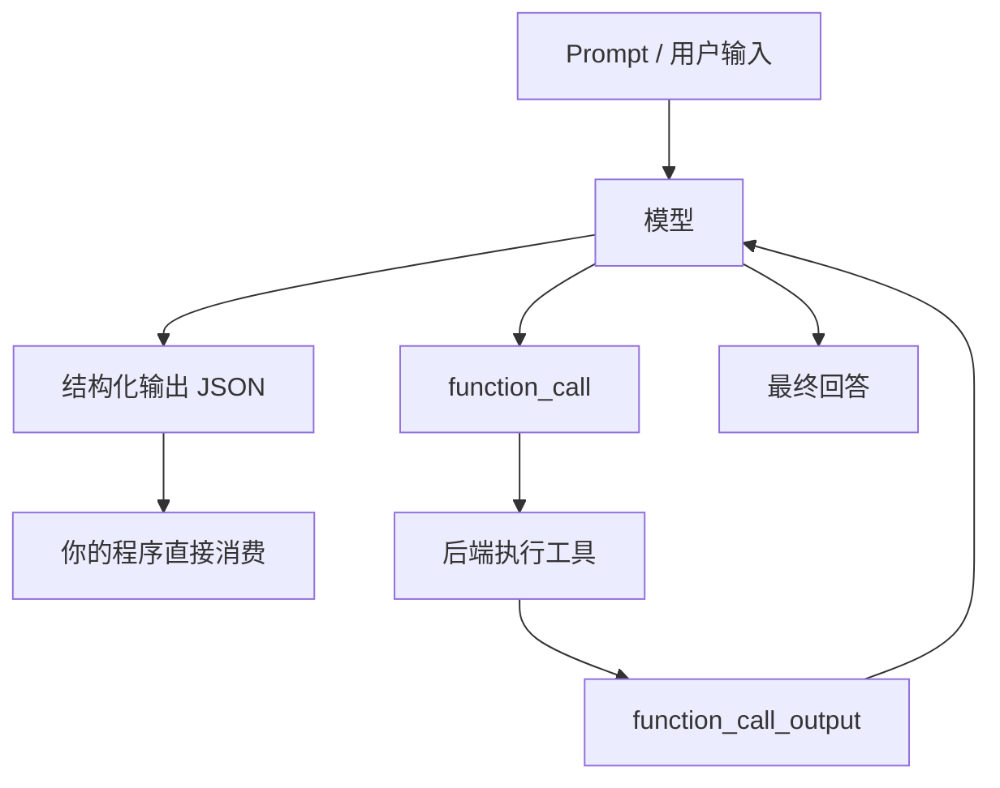

# 阶段四：结构化输出与 Function Calling

本阶段目标是把大模型从“会生成自然语言”升级成“能被程序稳定消费”和“能请求你的系统执行工具”。结构化输出解决的是输出格式可靠性，Function Calling 解决的是模型和业务系统之间的动作边界。

## 本阶段你会学到什么

1. 为什么只在 Prompt 里写“请输出 JSON”还不够。
2. Structured Outputs 和 JSON mode 的区别。
3. 如何用 JSON Schema 约束 Android 崩溃分析结果。
4. Function Calling 的完整调用循环。
5. 工具定义、参数校验、工具执行、工具结果回传分别由谁负责。
6. Android / 后端 / 模型之间如何划分工具权限。
7. 如何运行本阶段 Demo。

## 章节目录

1. [结构化输出基础](./01-结构化输出基础.md)
2. [JSON Schema 与 Android 崩溃分析](./02-JSONSchema与Android崩溃分析.md)
3. [Function Calling 工具调用基础](./03-FunctionCalling工具调用基础.md)
4. [Demo：结构化输出与工具调用](./04-Demo-结构化输出与工具调用.md)

## 核心关系图



## 一句话区分

```text
结构化输出：模型最终回答要长成什么样。
Function Calling：模型需要你的系统帮它做什么。
```

## 官方资料

- [Structured Outputs](https://developers.openai.com/api/docs/guides/structured-outputs)
- [Function Calling](https://developers.openai.com/api/docs/guides/function-calling)
- [Using tools](https://developers.openai.com/api/docs/guides/tools)
- [Migrate to Responses API](https://developers.openai.com/api/docs/guides/migrate-to-responses)
