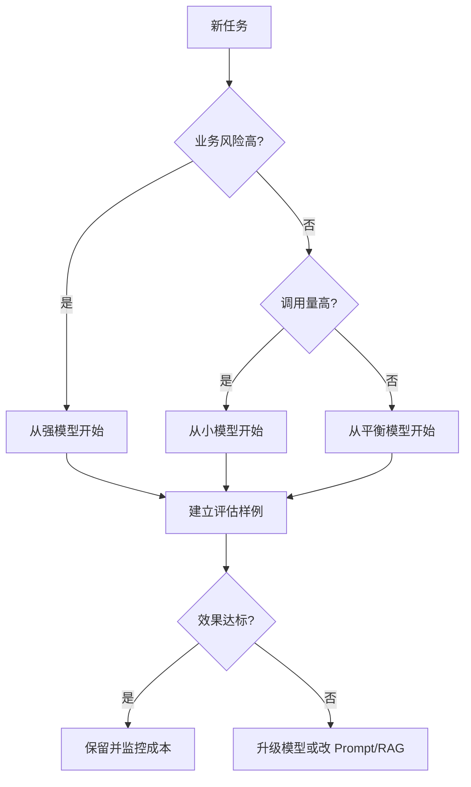

# 01. 模型选型基础

## 1. 为什么要学习模型选型

如果只是做 Demo，直接选一个强模型就能跑起来。但真实项目要考虑：

- 成本
- 延迟
- 并发
- 上下文长度
- 工具调用能力
- 多模态能力
- 输出稳定性
- 业务风险

模型选型的本质是工程取舍。

## 2. 不要所有任务都用最强模型

最强模型通常适合复杂推理、代码分析、多步骤 Agent、长上下文任务。

但很多任务不需要最强模型：

- 简单分类
- 意图识别
- 文本改写
- 字段抽取
- 短问答
- 高频低风险任务

这些任务可以用更小、更便宜、更快的模型。

## 3. 选型核心维度

| 维度 | 说明 |
| --- | --- |
| 质量 | 能否稳定完成任务 |
| 延迟 | 用户等待时间 |
| 成本 | 输入、输出、工具、缓存费用 |
| 上下文窗口 | 一次能放多少信息 |
| 最大输出 | 能生成多长结果 |
| 工具调用 | 是否支持 Function Calling、Web search、File search |
| 多模态 | 是否支持图片、语音等输入输出 |
| 稳定性 | 输出格式、指令遵循、拒答行为是否可控 |

## 4. 当前常见模型层级

以 OpenAI 官方资料为例，当前模型页推荐：复杂推理和编码可以从旗舰模型开始；如果优化延迟和成本，可以选择更小的变体。

可以抽象成三层：

```text
强模型：复杂推理、代码、Agent、关键业务
中模型：RAG、普通问答、结构化分析、后台任务
小模型：分类、抽取、短文本、高并发低风险任务
```

不要把具体模型名写死在业务代码里。建议通过配置管理：

```json
{
  "android_crash_analysis": "gpt-5.4-mini",
  "code_review_quality": "gpt-5.5",
  "intent_classification": "gpt-5.4-nano"
}
```

## 5. 按任务类型选模型

### Android 崩溃日志分析

特点：

- 需要一定推理
- 需要结构化输出
- 输入可能较长
- 业务风险中等

建议：

- 初期用平衡型模型。
- 如果分析质量不足，再升级强模型。
- 如果只是提取异常类型，可以用小模型。

### 代码 Review

特点：

- 需要理解上下文
- 需要推理
- 容易误报和漏报
- 对质量要求高

建议：

- 质量优先时用强模型。
- 批量初筛可以用中模型。
- 最终高风险 Review 再用强模型复核。

### RAG 知识库问答

特点：

- 答案质量很依赖检索内容。
- 不一定总需要最强模型。
- 需要控制上下文质量。

建议：

- 先优化检索和上下文，再升级模型。
- 高频问题可以用中小模型。
- 高风险问题用强模型并要求引用来源。

### Android 语音助手

特点：

- 延迟敏感。
- 用户希望快速反馈。
- 单轮输入通常较短。

建议：

- 简单意图用小模型或本地规则。
- 复杂对话走强一些的云端模型。
- 语音链路里要特别关注首 Token 延迟和 TTS 启播时间。

## 6. 推荐决策流程



## 7. 本章小结

模型选型不要凭感觉。推荐顺序：

```text
明确任务 -> 估算风险 -> 估算调用量 -> 选择起点 -> 跑评估 -> 再决定是否升级或降级
```

下一章会讲成本公式和 Token 预算。
