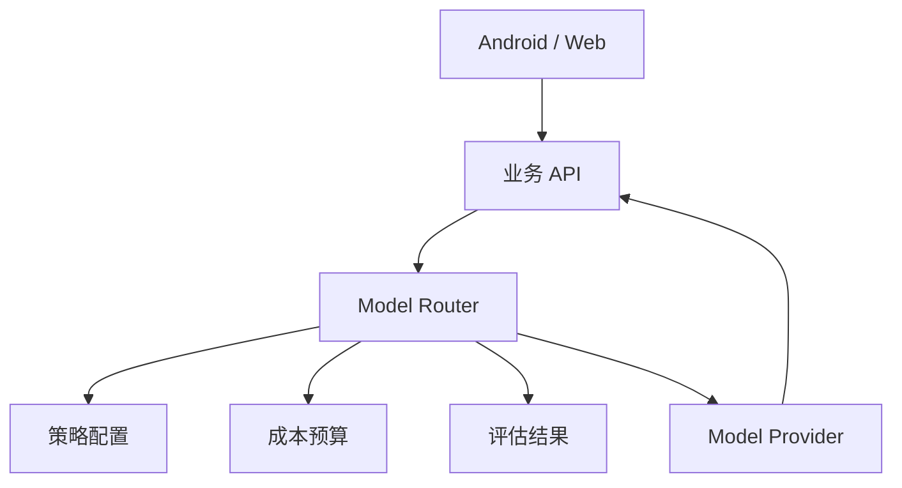

# 03. Android 与后端模型路由策略

## 1. 什么是模型路由

模型路由是指：同一个系统里，不同任务使用不同模型。

不要在代码里到处写死模型名，而应该由后端统一决定：

```text
任务类型 + 用户等级 + 风险等级 + 成本预算 + 延迟要求 -> 选择模型
```

## 2. 为什么模型路由应该放后端

Android 端不适合决定模型，原因是：

- 模型名可能变化。
- 价格可能变化。
- 灰度策略应该后端控制。
- 需要统一日志和成本统计。
- 需要根据用户权限选择模型。
- 需要隐藏供应商细节。

推荐：

```text
Android 只传业务任务
后端决定模型和参数
```

## 3. 推荐后端结构



`Model Router` 可以根据配置选择：

```json
{
  "android_crash_analysis": {
    "default": "gpt-5.4-mini",
    "fallback": "gpt-5.4",
    "quality_review": "gpt-5.5"
  },
  "intent_classification": {
    "default": "gpt-5.4-nano"
  }
}
```

## 4. 常见路由策略

### 按任务类型路由

```text
intent_classification -> 小模型
android_crash_analysis -> 中模型
code_review_quality -> 强模型
agent_workflow -> 强模型
```

### 按风险等级路由

```text
低风险 -> 小模型
中风险 -> 中模型
高风险 -> 强模型 + 人工确认
```

### 按用户等级路由

```text
免费用户 -> 小模型 + 限流
普通用户 -> 中模型
高级用户 -> 强模型或更高配额
```

### 按失败重试路由

```text
第一次：中模型
格式失败：同模型重试
质量不足：升级强模型
仍失败：人工处理
```

## 5. Android 场景推荐

### 大模型聊天助手

```text
普通闲聊：中小模型
复杂问题：强模型
工具调用：支持 tools 的模型
语音短问答：低延迟模型
```

### 崩溃日志分析

```text
异常类型提取：小模型
结构化分析：中模型
疑难问题或代码级分析：强模型
```

### AI 代码 Review

```text
规则扫描：本地规则
普通 Review：中模型
关键模块 Review：强模型
最终合并前检查：强模型 + 测试验证
```

### RAG 问答

```text
检索质量好：中模型
检索结果复杂：强模型
高频 FAQ：小模型或缓存答案
```

## 6. 降级策略

模型服务可能失败、限流或成本超预算。

后端应该支持：

- 切换备用模型
- 降低输出长度
- 关闭非必要工具
- 返回排队状态
- 降级到缓存答案
- 提示用户稍后重试

Android 端只需要处理统一状态：

```json
{
  "status": "degraded",
  "message": "当前分析服务繁忙，已使用快速模式返回初步结果。"
}
```

## 7. 模型路由日志

每次调用建议记录：

```json
{
  "trace_id": "trace_001",
  "task": "android_crash_analysis",
  "selected_model": "gpt-5.4-mini",
  "router_policy": "balanced_v1",
  "input_tokens": 2300,
  "output_tokens": 600,
  "estimated_cost": 0.0045,
  "latency_ms": 2800
}
```

后续你可以按这些数据优化策略。

## 8. 本章小结

模型路由的目标是：

```text
让大多数请求便宜又快，
让关键请求足够可靠，
让模型变更不影响客户端。
```

下一章会运行 Demo，做成本估算和简单模型推荐。
