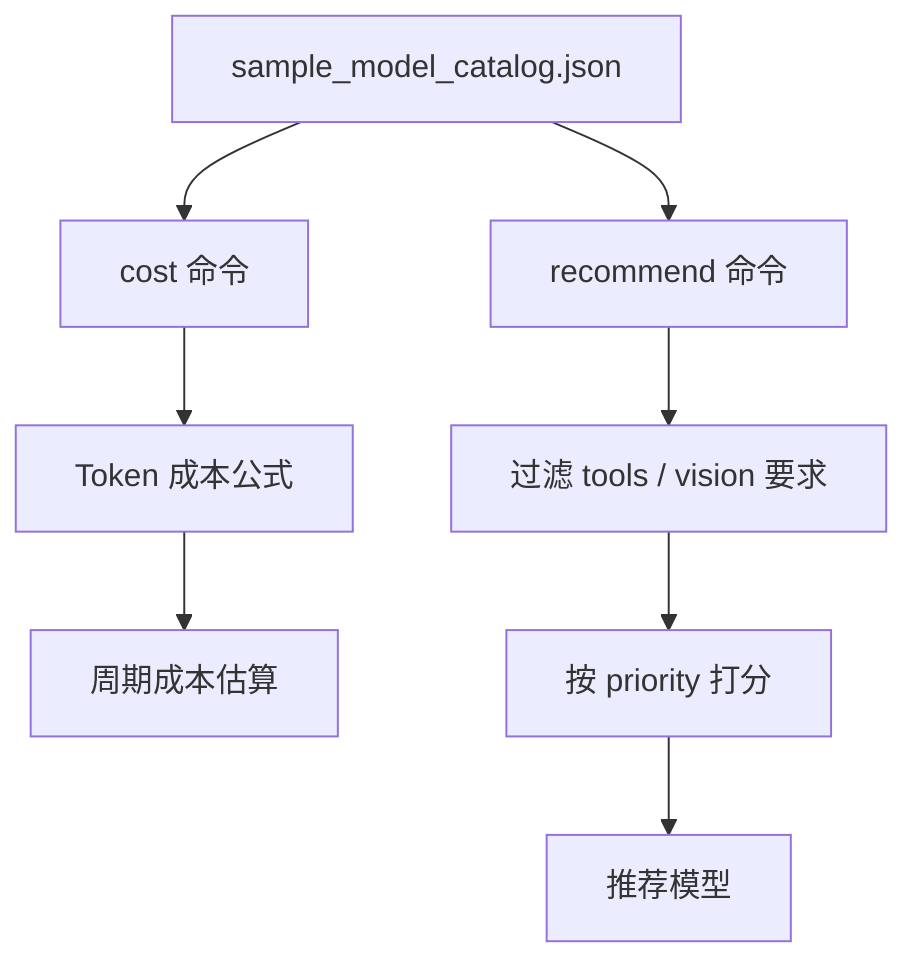

# 04. Demo：模型成本估算与选型

本阶段 Demo 位置：

```text
大模型技术学习教程/05-模型选型与成本评估/demo/model_cost_demo.py
```

这个 Demo 使用 Python 标准库实现，不请求真实 API。它的目标是学习：

- 如何按 Token 估算成本。
- 如何估算一段时间内的总成本。
- 如何从可配置模型目录里做简单模型推荐。
- 为什么价格配置应该可刷新，而不是写死在代码里。

## 1. 文件结构

```text
demo/
  model_cost_demo.py
  sample_model_catalog.json
  tests/
    test_model_cost_demo.py
```

`sample_model_catalog.json` 是学习用示例。生产环境请以官方价格页和供应商合同为准刷新。

## 2. 估算成本

示例：

```powershell
python ".\大模型技术学习教程\05-模型选型与成本评估\demo\model_cost_demo.py" `
  cost `
  --model "gpt-5.5" `
  --input-tokens 10000 `
  --cached-input-tokens 4000 `
  --output-tokens 2000 `
  --requests-per-day 100 `
  --days 30
```

输出会包含：

- 单次输入成本
- 单次缓存输入成本
- 单次输出成本
- 单次总成本
- 总请求量
- 周期总成本

## 3. 推荐模型

质量优先的代码 Review：

```powershell
python ".\大模型技术学习教程\05-模型选型与成本评估\demo\model_cost_demo.py" `
  recommend `
  --task coding `
  --priority quality `
  --requires-tools
```

成本优先的简单分类：

```powershell
python ".\大模型技术学习教程\05-模型选型与成本评估\demo\model_cost_demo.py" `
  recommend `
  --task classification `
  --priority cost
```

Android 崩溃分析的平衡选择：

```powershell
python ".\大模型技术学习教程\05-模型选型与成本评估\demo\model_cost_demo.py" `
  recommend `
  --task android_crash_analysis `
  --priority balanced `
  --requires-tools
```

## 4. 运行测试

```powershell
python -m unittest discover -s ".\大模型技术学习教程\05-模型选型与成本评估\demo\tests"
```

测试覆盖：

- 单次调用成本公式。
- 缓存输入成本。
- 周期总成本。
- 质量优先模型推荐。
- 成本优先模型推荐。
- 工具能力过滤。

## 5. Demo 流程图



## 6. 生产环境怎么改造

真实项目里，建议把模型目录做成配置：

```json
{
  "models": [
    {
      "id": "xxx",
      "input_price_per_million": 0,
      "output_price_per_million": 0,
      "supports_tools": true,
      "supports_vision": true
    }
  ]
}
```

然后后端服务定期或手动刷新：

- 官方模型页
- 官方价格页
- 供应商合同价
- 企业内部限流规则
- 评估集得分

## 7. 本阶段小结

学完第五阶段后，你应该具备这几个能力：

```text
知道模型选型要看质量、成本、延迟、上下文和工具能力
会按 Token 估算成本
知道 Android 不应该直接决定模型
能设计简单模型路由
能用配置管理模型价格和能力
```

下一阶段建议进入 Embedding 与向量检索，为 RAG 做准备。
