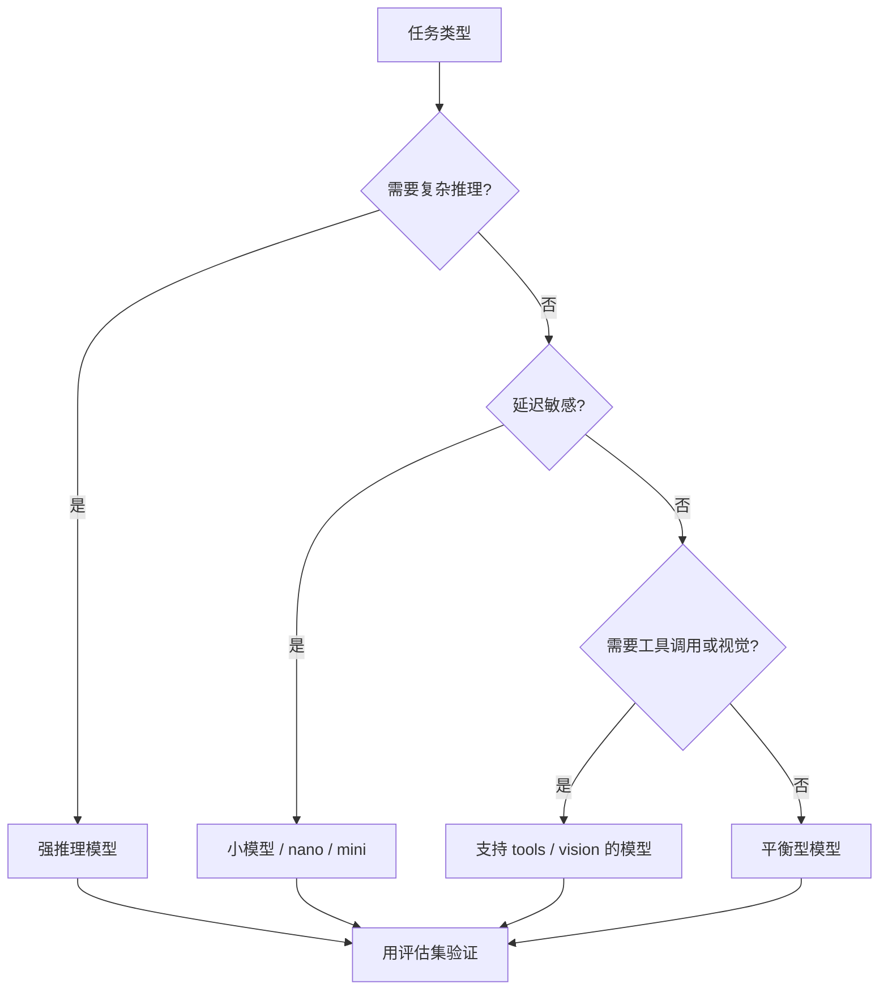

# 阶段五：模型选型与成本评估

本阶段目标是让你知道“什么时候用强模型，什么时候用小模型，怎么估算成本，怎么做模型路由”。模型选型不是只看谁最强，而是要在质量、延迟、成本、上下文、工具能力、稳定性之间做工程取舍。

## 本阶段你会学到什么

1. 模型选型的核心维度。
2. 为什么不能所有任务都用最强模型。
3. 如何估算输入 Token、输出 Token、缓存输入和工具调用成本。
4. Android、后端、RAG、Agent 场景如何选模型。
5. 如何设计模型路由和降级策略。
6. 如何运行本阶段成本估算 Demo。

## 章节目录

1. [模型选型基础](./01-模型选型基础.md)
2. [成本估算与 Token 预算](./02-成本估算与Token预算.md)
3. [Android 与后端模型路由策略](./03-Android与后端模型路由策略.md)
4. [Demo：模型成本估算与选型](./04-Demo-模型成本估算与选型.md)

## 选型总览图

## 重要提醒

模型能力、价格、上下文窗口和可用端点会变化。教程里的示例模型目录用于学习估算方法，真实项目请以官方模型页、价格页和你自己的供应商合同为准。

## 官方资料

- [Latest model guide](https://developers.openai.com/api/docs/guides/latest-model)
- [Models](https://developers.openai.com/api/docs/models)
- [Compare models](https://developers.openai.com/api/docs/models/compare)
- [Pricing](https://developers.openai.com/api/docs/pricing)
