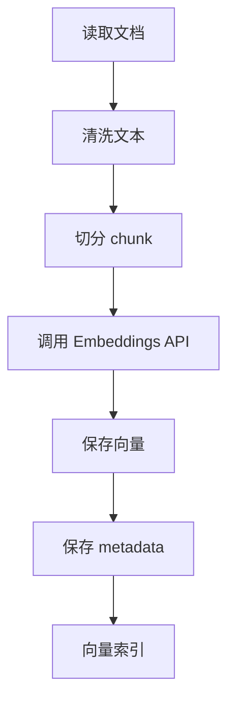
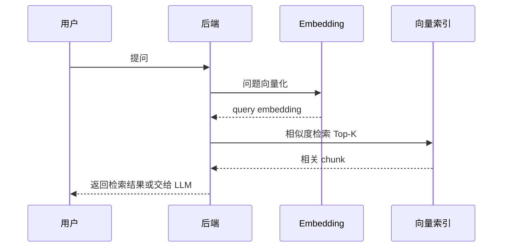

# 02. 文本切分、向量索引与相似度

## 1. 为什么要切分文本

真实文档通常很长：

- 产品文档
- 代码规范
- 崩溃排查手册
- API 文档
- 项目 README
- 后端接口说明

如果把整篇文档生成一个向量，会有问题：

- 语义太混杂
- 检索结果不精确
- 无法定位具体段落
- 后续放进 Prompt 会太长

所以要把文档切成 chunk。

## 2. chunk 是什么

chunk 是文档中的一个片段。

例如：

```text
文档：Android 稳定性排查手册

chunk 1：NullPointerException 排查
chunk 2：ANR 排查
chunk 3：内存泄漏排查
chunk 4：日志采集规范
```

检索时返回的是 chunk，而不是整篇文档。

## 3. chunk 大小怎么选

没有唯一标准，要结合业务。

经验建议：

| 场景 | chunk 大小 |
| --- | --- |
| FAQ | 一问一答一个 chunk |
| 技术文档 | 300 到 800 字左右 |
| 代码 | 函数、类、文件片段 |
| 崩溃案例 | 一个案例一个 chunk |
| API 文档 | 一个接口或一个字段组 |

chunk 太小：上下文不足。

chunk 太大：检索不精确，成本高。

## 4. overlap 是什么

overlap 是相邻 chunk 的重叠部分。

比如：

```text
chunk 1：0 - 500 字
chunk 2：420 - 920 字
```

中间重叠 80 字。

这样做的好处是避免关键信息刚好被切断。

## 5. 向量索引流程



每条 chunk 通常要保存：

```json
{
  "document_id": "android-crash-guide",
  "chunk_id": "android-crash-guide-001",
  "title": "NullPointerException 排查",
  "text": "...",
  "embedding": [0.1, -0.2, ...],
  "metadata": {
    "source": "docs/android-crash.md",
    "updated_at": "2026-07-09"
  }
}
```

## 6. 查询流程



## 7. Top-K 是什么

Top-K 表示返回最相似的 K 个片段。

例如：

```text
top_k = 5
```

返回相似度最高的 5 个 chunk。

K 太小可能漏掉信息。

K 太大会增加噪音和 Prompt 成本。

## 8. 只靠向量检索的问题

向量检索很强，但不是万能。

常见问题：

- 检索到语义相近但事实不相关的片段
- 相似度高不代表答案正确
- 文档切分不好会漏召回
- 查询太短或太模糊会影响结果
- 元数据过滤缺失会混入错误业务线内容

后续 RAG 阶段会继续讲：

- query rewrite
- rerank
- metadata filter
- hybrid search
- 引用来源

## 9. 本章小结

向量检索的基本闭环是：

```text
文档 -> chunk -> embedding -> vector index
问题 -> embedding -> top-k search -> relevant chunks
```

下一章会结合 Android 和 RAG 场景看怎么落地。
