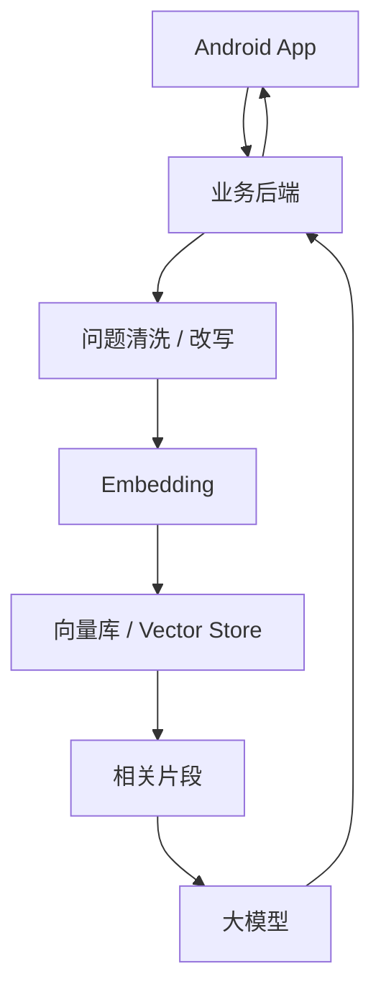

# 03. Android 与 RAG 场景中的向量检索

## 1. Android 项目里哪些内容适合向量化

适合进入向量库的内容：

- 崩溃排查手册
- 常见问题 FAQ
- 接口文档
- 业务规则文档
- 代码规范
- 历史 Bug 记录
- 版本变更说明
- 测试用例说明
- 用户手册

不建议直接进入向量库的内容：

- 密钥
- Token
- 用户隐私数据
- 大量重复日志
- 未脱敏生产数据
- 没有清洗的完整 logcat

## 2. Android 崩溃知识库

可以把崩溃案例整理成：

```json
{
  "title": "NullPointerException in MainActivity",
  "symptom": "启动后闪退",
  "exception": "java.lang.NullPointerException",
  "root_cause": "onCreate 中读取未初始化对象",
  "fix": "移动初始化逻辑并增加空值保护",
  "tags": ["crash", "npe", "activity"]
}
```

生成文本后写入向量库。

用户问：

```text
启动后空指针闪退怎么查？
```

检索可以找回历史案例。

## 3. 项目文档知识库

适合回答：

- 某个接口怎么用？
- 某个业务规则是什么？
- 某个页面跳转逻辑在哪里？
- 某个配置项怎么改？
- 某类错误以前怎么处理？

流程：

```text
Markdown / API 文档 / README
  -> 清洗
  -> 切分
  -> Embedding
  -> 向量库
  -> 用户问题检索
```

## 4. 代码库检索

代码库也可以做向量检索，但要注意切分策略。

适合的 chunk：

- 函数
- 类
- 接口定义
- 路由处理器
- ViewModel
- Activity
- 测试用例

metadata 很重要：

```json
{
  "repo": "xiaou",
  "path": "app/src/main/java/...",
  "symbol": "MainActivity",
  "language": "kotlin",
  "branch": "main"
}
```

代码检索通常建议结合关键词搜索、符号索引和向量检索，而不是只靠向量。

## 5. 自建向量库 vs 托管 File Search

### 自建向量库

你自己负责：

- 文档清洗
- 切分
- Embedding
- 向量数据库
- 元数据过滤
- 检索
- rerank
- 权限控制

优点：

- 控制力强
- 可接入内部系统
- 可做复杂权限和过滤

缺点：

- 工程量大
- 运维成本高

### 托管 File Search / Vector Store

平台帮你管理：

- 文件上传
- 向量化
- 向量存储
- 检索
- 工具调用

优点：

- 上手快
- 少写很多基础设施

缺点：

- 控制力弱一些
- 和平台能力绑定
- 权限和数据治理要仔细评估

## 6. Android App 的推荐架构



Android 端不直接访问向量库。

后端负责：

- 鉴权
- 文档权限过滤
- 检索参数
- Prompt 组装
- 日志追踪

## 7. 检索质量怎么判断

先看召回，不要一开始只看最终回答。

检查：

- Top-1 是否相关
- Top-3 是否覆盖答案
- 是否混入错误文档
- chunk 是否过短或过长
- metadata 是否正确
- 用户问题是否需要改写

建议做一个小评估表：

| 问题 | 应该命中的文档 | 实际 Top-3 | 是否命中 |
| --- | --- | --- | --- |
| App 卡死无响应怎么查 | Android ANR 排查 | ... | 是 |
| 启动空指针闪退 | Android 崩溃排查 | ... | 是 |

## 8. 本章小结

向量检索在 Android 和后端项目里的价值是：

```text
让系统从项目文档、历史问题、代码片段中找到和用户问题最相关的上下文。
```

下一章会运行本地 Demo，完整走一遍 chunk、embedding、search。
