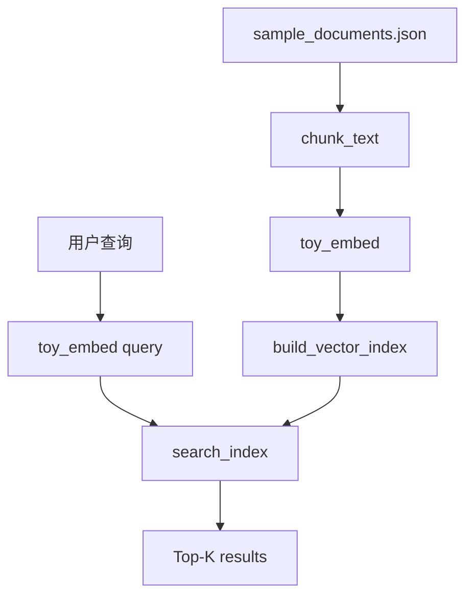

# 04. Demo：本地玩具向量检索

本阶段 Demo 位置：

```text
大模型技术学习教程/06-Embedding与向量检索/demo/vector_search_demo.py
```

它使用 Python 标准库实现，不需要 API Key。注意：`toy_embed` 只是为了演示流程，不是真实 Embedding 模型。

## 1. 文件结构

```text
demo/
  vector_search_demo.py
  sample_documents.json
  tests/
    test_vector_search_demo.py
```

## 2. 打印 Embeddings API 请求体示例

```powershell
python ".\大模型技术学习教程\06-Embedding与向量检索\demo\vector_search_demo.py" `
  payload `
  --input "Android 崩溃日志怎么分析" `
  --dimensions 256
```

输出类似：

```json
{
  "model": "text-embedding-3-small",
  "input": ["Android 崩溃日志怎么分析"],
  "encoding_format": "float",
  "dimensions": 256
}
```

真实项目会把这个请求发送到 `/v1/embeddings`。

## 3. 查看文档切分

```powershell
python ".\大模型技术学习教程\06-Embedding与向量检索\demo\vector_search_demo.py" `
  chunks `
  --max-chars 120 `
  --overlap 20
```

你可以看到每篇文档被切成哪些 chunk。

## 4. 执行本地向量检索

查询 Android 崩溃：

```powershell
python ".\大模型技术学习教程\06-Embedding与向量检索\demo\vector_search_demo.py" `
  search `
  --query "空指针崩溃 NullPointerException 怎么排查" `
  --top-k 2
```

查询 ANR：

```powershell
python ".\大模型技术学习教程\06-Embedding与向量检索\demo\vector_search_demo.py" `
  search `
  --query "App 卡死无响应 主线程" `
  --top-k 2
```

输出会包含：

- score
- document_id
- title
- chunk_index
- text

## 5. 运行测试

```powershell
python -m unittest discover -s ".\大模型技术学习教程\06-Embedding与向量检索\demo\tests"
```

测试覆盖：

- Embeddings API 请求体构造。
- chunk overlap 行为。
- overlap 参数校验。
- cosine similarity。
- 崩溃问题能检索到崩溃文档。
- 无响应问题能检索到 ANR 文档。

## 6. Demo 流程图



## 7. 真实项目怎么替换

Demo 中：

```text
toy_embed(text)
```

真实项目替换为：

```text
Embeddings API / 本地 Embedding 模型
```

Demo 中：

```text
Python list 保存 index
```

真实项目替换为：

```text
向量数据库 / OpenAI Vector Store / pgvector / Milvus / Qdrant / Elasticsearch vector search
```

## 8. 本阶段小结

学完第六阶段后，你应该理解：

```text
Embedding 负责语义表示
chunk 负责控制检索粒度
vector index 负责存储和搜索
top-k 负责返回相关片段
RAG 会把这些片段交给大模型生成答案
```

下一阶段建议进入“数据工程与知识库构建”，把文档清洗、去重、元数据、增量更新补完整。
