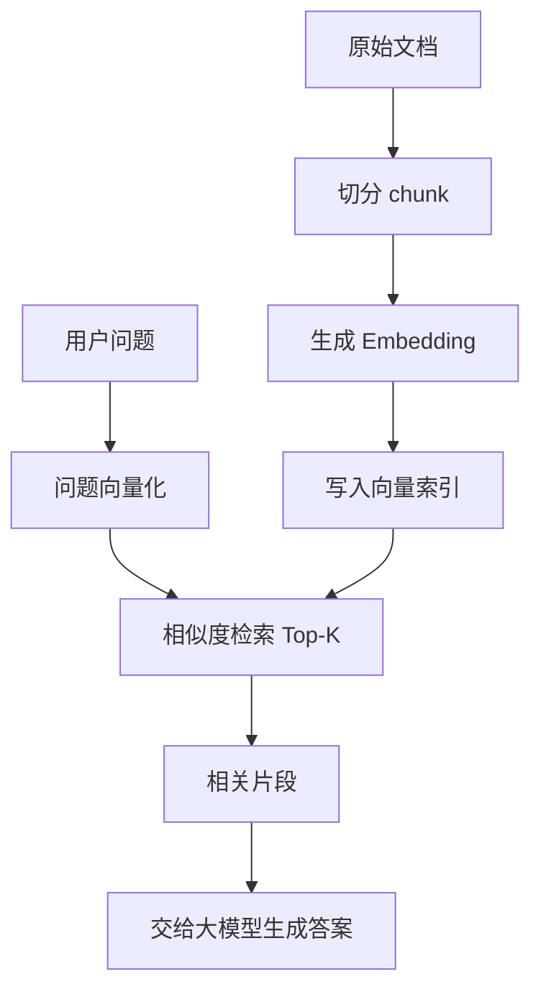

# 阶段六：Embedding 与向量检索

本阶段目标是理解“如何把文本变成向量，并用向量做语义检索”。这是 RAG、知识库问答、相似问题推荐、代码片段检索的基础。

## 本阶段你会学到什么

1. Embedding 是什么，为什么能做语义检索。
2. 向量、维度、距离、余弦相似度的基本概念。
3. 文档为什么要切分成 chunk。
4. 向量索引和 Top-K 检索的基本流程。
5. 自建向量库和托管 File Search / Vector Store 的区别。
6. Android 项目知识库、崩溃库、代码库如何接入向量检索。
7. 如何运行一个本地玩具向量检索 Demo。

## 章节目录

1. [Embedding 基础](./01-Embedding基础.md)
2. [文本切分、向量索引与相似度](./02-文本切分向量索引与相似度.md)
3. [Android 与 RAG 场景中的向量检索](./03-Android与RAG场景中的向量检索.md)
4. [Demo：本地玩具向量检索](./04-Demo-本地玩具向量检索.md)

## 核心流程图

## 重要说明

本阶段 Demo 使用本地 `toy_embed` 演示向量检索流程，只用于学习。真实项目应使用真实 Embedding 模型、向量数据库，或使用托管 Vector Store / File Search。

## 官方资料

- [Vector embeddings](https://developers.openai.com/api/docs/guides/embeddings)
- [Create embeddings API reference](https://developers.openai.com/api/reference/python/resources/embeddings/methods/create)
- [Retrieval](https://developers.openai.com/api/docs/guides/retrieval)
- [File search](https://developers.openai.com/api/docs/guides/tools-file-search)
