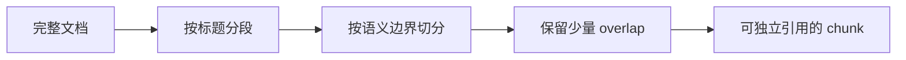

# 清洗、切分、元数据与质量

知识库流水线的核心工作可以拆成四步：清洗、切分、标注元数据、做质量检查。它们决定后面的向量检索能不能找到正确片段。

## 文档清洗

清洗不是润色文章，而是让内容更适合机器处理。

常见清洗项：

1. 统一编码为 UTF-8。
2. 清理多余空白、零宽字符、重复换行。
3. 删除导航、页脚、版权模板、无意义目录。
4. 去除重复内容，例如多个页面里的相同免责声明。
5. 脱敏手机号、邮箱、Token、身份证、订单号等敏感信息。
6. 把图片、表格、接口字段解释转换成可检索文本。

对 Android 场景来说，崩溃日志可以保留异常类型、关键堆栈、线程名、业务入口，但应该去掉用户 ID、设备唯一标识和完整请求参数。

## 文本切分

切分的目标不是把文本机械切成固定长度，而是让每个 chunk 尽量表达一个完整知识点。

常见切分策略：

| 策略 | 适合场景 | 风险 |
| --- | --- | --- |
| 按标题切分 | Markdown、产品文档、接口文档 | 标题层级乱会影响效果 |
| 按固定长度切分 | 日志、纯文本、长 FAQ | 可能切断语义 |
| 按段落切分 | 说明文、知识文章 | 段落太长时仍要二次切分 |
| 按结构字段切分 | JSON、表格、工单 | 字段缺失时需要兜底 |

OpenAI 的 Retrieval / Vector Store 文档里也强调了 chunking strategy：托管向量库会自动切分、生成向量并索引；你也可以配置 chunk 大小和 overlap。自建流水线时也要保留类似思路。

## 元数据标注

元数据是让检索结果“可控”的关键。

| 元数据 | 用途 |
| --- | --- |
| `doc_id` | 回溯原始文档 |
| `chunk_id` | 精确引用片段 |
| `source_uri` | 展示来源和调试 |
| `tags` | 场景过滤 |
| `version` | 判断是否过期 |
| `owner` | 找维护人 |
| `visibility` | 做权限过滤 |
| `checksum` | 判断内容是否变化 |

没有元数据的向量检索只能“相似”，有元数据的向量检索才能“可治理”。

## 质量检查

每次构建知识库都应该做基础质量检查：

1. 空文档数量是否为 0。
2. 每个文档是否有稳定 `id`。
3. 每个 chunk 是否有来源。
4. chunk 长度是否过短或过长。
5. 重复 checksum 是否异常增多。
6. 敏感字段是否已经脱敏。
7. 删除文档是否真的应该从索引中删除。
8. 高价值问题是否能检索到正确片段。

可以把这些检查放进 CI，至少在知识库发布前跑一次。大模型知识库本质上也是生产数据，不能靠手感上线。

## Android 开发者视角

如果要给 Android 团队做一个“项目排查助手”，推荐先收集这些资料：

1. 崩溃排查手册。
2. ANR 排查手册。
3. 网络错误码说明。
4. 登录、支付、权限、推送等核心链路说明。
5. 最近 3 个版本的高频线上问题复盘。

然后给每条资料补上 `tags`、`version`、`owner` 和 `visibility`，再进入切分和向量化阶段。
