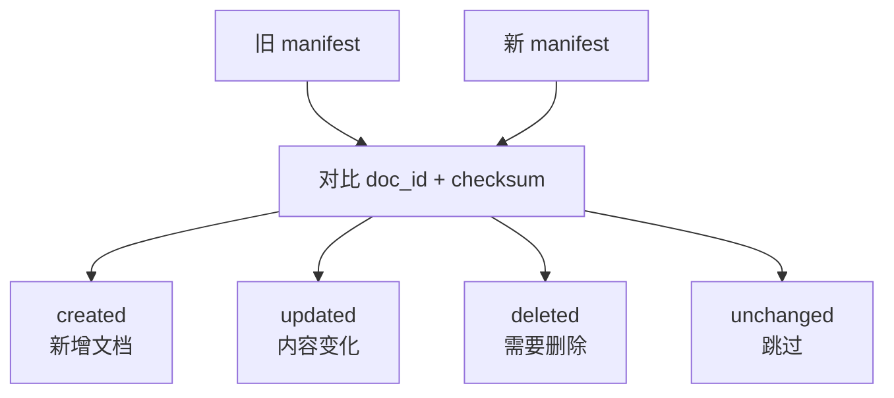

# 增量同步、版本治理与权限

知识库一旦上线，就会不断变化。产品规则会改、接口会升级、崩溃经验会更新、旧文档会删除。真正的工程难点不是第一次导入，而是持续同步。

## 为什么需要增量同步

如果每次都全量重建知识库，会遇到几个问题：

1. 成本高：重复生成 Embedding。
2. 慢：文档多时构建时间很长。
3. 风险大：一次失败可能影响全部检索。
4. 难回滚：不知道哪次变更引入了问题。

更好的方式是给每个文档生成 checksum，并保存 manifest。下一次构建时，把新 manifest 和旧 manifest 对比，得到同步计划。



## Manifest 应包含什么

一个简单 manifest 可以长这样：

```json
{
  "schema_version": "1.0",
  "chunking": {
    "max_chars": 700,
    "overlap": 120
  },
  "documents": {
    "android-crash-guide": {
      "title": "Android 崩溃排查知识",
      "source_uri": "app://knowledge/android/crash",
      "checksum": "sha256...",
      "chunk_count": 4,
      "version": "v1",
      "tags": ["android", "crash", "logcat"]
    }
  }
}
```

这里的 `checksum` 不是为了安全加密，而是为了判断内容是否变化。只要正文或关键元数据变了，就应该重新切分和重新索引。

## 版本治理

知识库要能回答三个问题：

1. 当前线上使用的是哪一版知识库？
2. 某个回答引用的 chunk 来自哪份文档、哪个版本？
3. 如果新知识库效果变差，能不能回滚？

建议保留这些信息：

| 信息 | 作用 |
| --- | --- |
| 构建批次号 | 定位一次知识库发布 |
| 文档 checksum | 判断文档是否变化 |
| chunk checksum | 判断片段是否变化 |
| 原始 source_uri | 回溯来源 |
| 构建参数 | 回溯切分策略和过滤条件 |
| 评测结果 | 对比不同版本质量 |

## 权限与隔离

知识库权限不能只依赖前端隐藏入口。检索前就要做过滤。

常见做法：

1. 按业务域拆索引，例如 `mobile-public`、`mobile-internal`、`ops-private`。
2. 每个 chunk 带上 `visibility` 或 `tenant_id`。
3. 后端根据登录用户权限决定可检索范围。
4. 不让 Android 客户端直接访问向量库。
5. 对含敏感信息的知识库单独审计调用日志。

移动端应该只调用自己的后端接口，由后端完成权限判断、检索、上下文拼接和大模型调用。

## 托管 Vector Store 与自建流水线

OpenAI 的 Retrieval / File Search 能通过 Vector Store 管理文件，并在文件加入后完成切分、Embedding 和索引。它适合快速搭建知识库问答，尤其是你不想先维护向量数据库和检索服务时。

自建流水线更适合这些情况：

1. 数据源很多，需要复杂清洗。
2. 权限模型复杂。
3. 需要跨 OpenAI、私有模型、企业搜索引擎复用。
4. 需要自定义 chunk、rerank、增量同步和质量检查。
5. 知识库必须部署在私有环境。

两种方式不是互斥的。你可以先用本阶段 Demo 这种离线流水线把文档规范化，再把输出文件上传到托管 Vector Store，或者写入自己的向量数据库。
