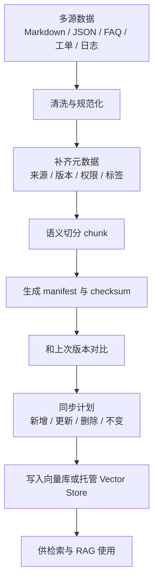

# 阶段七：数据工程与知识库构建

本阶段目标是理解“把业务资料变成可检索、可更新、可治理的知识库”这件事。上一阶段已经学过 Embedding 与向量检索，本阶段开始补齐 RAG 前面的数据工程能力。

对 Android、后端、前端开发者来说，知识库不是简单把一堆文档丢给模型，而是要解决来源、清洗、切分、元数据、版本、权限、增量同步和质量评估。

## 本阶段你会学到什么

1. 哪些数据适合进入大模型知识库。
2. 如何设计知识条目的最小字段规范。
3. 文档清洗、去重、脱敏、切分和元数据标注的基本方法。
4. 如何用 manifest 和 checksum 管理增量同步。
5. 自建知识库流水线和托管 Vector Store / File Search 的职责边界。
6. Android、后端、运营、客服、崩溃排查等场景如何组织知识。
7. 如何运行一个离线知识库构建 Demo。

## 章节目录

1. [知识库数据源与文档规范](./01-知识库数据源与文档规范.md)
2. [清洗、切分、元数据与质量](./02-清洗切分元数据与质量.md)
3. [增量同步、版本治理与权限](./03-增量同步版本治理与权限.md)
4. [Demo：离线知识库构建流水线](./04-Demo-离线知识库构建流水线.md)

## 核心流程图

## 和第六阶段的关系

第六阶段回答“如何检索”，第七阶段回答“检索的数据从哪里来、如何保持正确”。真实项目里，RAG 效果差经常不是模型不行，而是知识库文档过期、切分不合理、元数据缺失、权限混乱或重复内容太多。

## 官方资料

- [Retrieval](https://developers.openai.com/api/docs/guides/retrieval)
- [File search](https://developers.openai.com/api/docs/guides/tools-file-search)
- [Vector embeddings](https://developers.openai.com/api/docs/guides/embeddings)
