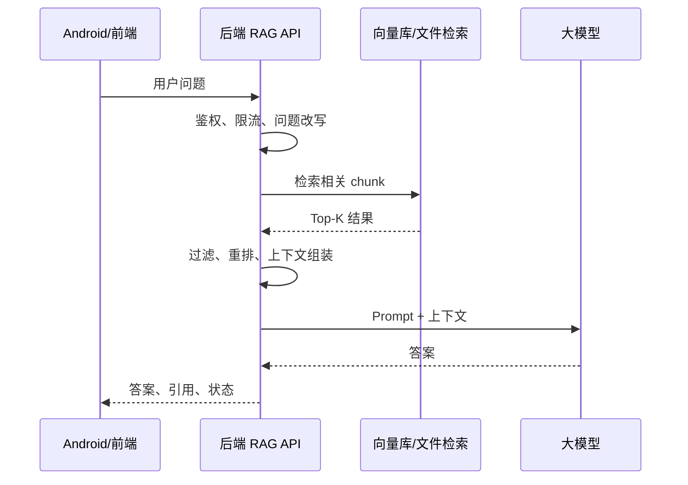

# RAG 基础与整体链路

RAG 是 Retrieval-Augmented Generation 的缩写，通常翻译为“检索增强生成”。它的核心思想很直接：不要让模型只依赖训练时学到的通用知识，而是在回答前先检索你的业务知识库，再让模型基于检索结果回答。

## 为什么需要 RAG

大模型本身擅长语言理解和生成，但它有几个天然限制：

1. 不知道你公司内部的最新产品规则。
2. 不知道你项目里的接口、错误码、崩溃经验。
3. 不知道刚刚发布的新文档。
4. 可能在信息不足时编造答案。
5. 很难直接追溯回答来自哪里。

RAG 的价值就是把“模型能力”和“业务资料”接起来。

## RAG 适合解决什么问题

| 场景 | 例子 |
| --- | --- |
| 知识库问答 | 客服 FAQ、产品规则、内部文档问答 |
| 开发助手 | 接口说明、错误码、崩溃排查、模块说明 |
| 运维助手 | 告警处理、发布回滚、故障复盘 |
| 代码库检索 | 查找相似实现、解释模块职责 |
| 移动端支持 | Android 弱网、崩溃、ANR、权限问题排查 |

对 Android 开发者来说，一个很典型的 RAG 应用是“线上问题排查助手”：输入崩溃摘要、接口错误、ANR 描述，系统从知识库找排查资料，再生成可执行的排查建议。

## 整体链路

## RAG 的三个核心模块

### 1. 检索模块

检索模块负责找到相关资料。它可以使用：

1. 向量检索。
2. 关键词检索。
3. 混合检索。
4. 托管 File Search。
5. 业务规则过滤。

第六阶段的 Embedding 与向量检索就是这个模块的基础。

### 2. 上下文模块

上下文模块负责把检索结果整理成模型能使用的材料。它要处理：

1. Top-K 结果数量。
2. chunk 去重。
3. token 长度限制。
4. 引用标记。
5. 权限过滤。
6. 不相关结果丢弃。

### 3. 生成模块

生成模块负责让模型基于上下文回答。Prompt 要明确告诉模型：

1. 只能基于检索上下文回答。
2. 上下文不足时要说明无法回答。
3. 回答要带引用。
4. 不要编造没有来源的事实。

## RAG 和微调的区别

| 维度 | RAG | 微调 |
| --- | --- | --- |
| 适合内容 | 经常变化的业务知识 | 稳定的风格、格式、任务行为 |
| 更新成本 | 更新知识库即可 | 需要训练或重新发布模型 |
| 可追溯性 | 容易保留引用 | 不天然保留来源 |
| 数据量要求 | 可以从小知识库开始 | 通常需要高质量训练样本 |
| 典型用途 | 文档问答、内部知识库 | 输出格式、分类习惯、专业风格 |

多数业务应用应该先做 RAG，再考虑微调。因为你的问题很可能不是“模型不会说”，而是“模型拿不到正确资料”。
