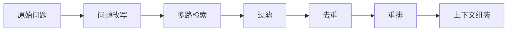

# 检索策略、重排与上下文组装

RAG 的答案质量很大程度上取决于检索质量。模型再强，如果上下文错了、旧了、重复了，回答也会跟着偏。

## 检索不是只取 Top-K

最简单的流程是：问题向量化，检索 Top-K，塞进 Prompt。但真实业务里通常还需要更多步骤。



## 问题改写

用户的问题经常很短，例如：

```text
支付失败怎么办？
```

后端可以把它改写成更适合检索的形式：

```text
移动端支付失败，可能涉及订单状态、支付渠道、业务错误码、网络错误、重复扣款和退款流程。
```

改写不是为了替用户编答案，而是补齐检索关键词。

## 多路检索

常见多路检索方式：

| 检索方式 | 适合内容 |
| --- | --- |
| 向量检索 | 语义相似问题、自然语言文档 |
| 关键词检索 | 错误码、类名、接口路径、订单号 |
| 元数据过滤 | 团队、版本、权限、业务线 |
| 历史问题检索 | 相似工单、相似崩溃、相似客服问题 |

例如 Android 崩溃问题里，`NullPointerException`、`FATAL EXCEPTION`、类名和方法名更适合关键词匹配；“页面切换后偶现崩溃”更适合向量检索。

## 重排与去重

初次检索拿到的 Top-K 不一定就是最终上下文。可以继续做：

1. 去掉重复 chunk。
2. 去掉低分结果。
3. 优先保留最新版本。
4. 优先保留权限范围更准确的文档。
5. 用 rerank 模型或规则重新排序。
6. 同一文档只保留最相关的几个片段。

Demo 里使用轻量规则做排序，真实项目可以逐步替换成向量库评分、关键词评分、rerank 模型或业务规则组合。

## 上下文组装

上下文不是越多越好。需要控制：

1. 总 token 长度。
2. 每个 chunk 是否有引用标记。
3. 是否包含标题和来源。
4. 是否按相关性排序。
5. 是否把敏感字段传给模型。

一个可用的上下文块可以长这样：

```text
[android-crash-guide#0]
标题：Android 崩溃排查知识
来源：app://knowledge/android/crash
相似度：0.82
内容：NullPointerException 需要结合 FATAL EXCEPTION、Caused by、业务堆栈和最近发布版本分析。
```

这里的 `[android-crash-guide#0]` 很重要。它让最终答案可以追溯来源，也方便前端展示“引用资料”。

## Prompt 规则

RAG Prompt 至少应该包含这些规则：

1. 只能基于检索上下文回答。
2. 上下文不足时说明无法回答。
3. 回答必须带引用。
4. 不要使用上下文外的事实。
5. 不要把检索上下文原样大段复制给用户。

这些规则不能完全防止模型出错，但能显著降低编造答案的概率。

## OpenAI File Search 的位置

OpenAI 的 File Search 是托管检索工具。你可以把文件放进 Vector Store，再在 Responses API 请求里启用 `file_search` 工具。平台会处理文件解析、切分、Embedding 和检索等步骤。

自建检索链路和 File Search 的区别：

| 方式 | 优点 | 适合场景 |
| --- | --- | --- |
| 托管 File Search | 上手快、少维护基础设施 | 快速做文档问答、原型验证 |
| 自建 RAG | 控制力强、可自定义权限和重排 | 企业知识库、复杂权限、多数据源 |

你可以先用托管方式验证产品价值，再把高复杂度部分迁移到自建流水线。
