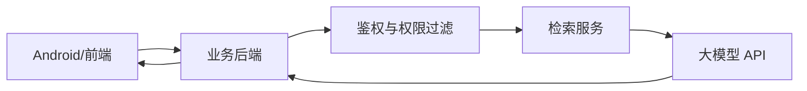

# 引用、兜底、权限与工程边界

RAG 系统真正上线后，最容易出问题的不是“能不能回答”，而是“回答是否可靠、是否能追溯、是否越权、是否在不知道时乱答”。

## 引用为什么重要

引用解决三个问题：

1. 用户知道答案从哪里来。
2. 开发者能调试检索结果。
3. 产品能追踪错误答案的来源。

一个好的 RAG 响应不应该只有自然语言答案，还应该返回结构化引用：

```json
{
  "answer": "排查 NullPointerException 时先看 FATAL EXCEPTION 和 Caused by。",
  "citations": [
    {
      "label": "[android-crash-guide#0]",
      "doc_id": "android-crash-guide",
      "title": "Android 崩溃排查知识",
      "source_uri": "app://knowledge/android/crash",
      "score": 0.82
    }
  ]
}
```

前端或 Android 端可以把引用展示成“参考资料”，点击后打开内部文档、FAQ 或排查手册。

## 没有答案时要兜底

RAG 系统必须允许自己“不知道”。

常见兜底策略：

1. 检索结果为空：返回“知识库没有足够信息”。
2. 检索分数太低：提示用户补充信息。
3. 上下文互相矛盾：要求人工确认。
4. 用户无权限：返回权限提示，不暴露资料存在。
5. 模型输出无引用：拒绝或重新生成。

兜底不是失败，而是可靠系统的一部分。

## 权限边界

不要让 Android 客户端直接访问向量库或大模型密钥。推荐结构：



后端需要负责：

1. 判断用户能访问哪些知识库。
2. 给检索请求加 metadata filter。
3. 过滤模型上下文。
4. 记录审计日志。
5. 控制调用频率和成本。
6. 屏蔽 API Key 和内部索引结构。

Android 端负责用户体验，不负责知识权限决策。

## 常见工程问题

| 问题 | 典型原因 | 处理方式 |
| --- | --- | --- |
| 答案看似合理但来源错 | 检索结果不相关 | 提高阈值、增加 rerank |
| 回答过长 | 上下文太多或 Prompt 约束弱 | 限制上下文长度和输出格式 |
| 旧答案反复出现 | 知识库未增量更新 | 检查 manifest 和 sync plan |
| 不该看的资料被引用 | 权限过滤在生成后才做 | 检索前先过滤 |
| 用户问具体错误码搜不到 | 只做向量检索 | 加关键词或混合检索 |
| 模型编造 | 上下文不足但未兜底 | 加 no-answer 判断 |

## RAG API 的推荐响应结构

```json
{
  "status": "answered",
  "answer": "...",
  "citations": [],
  "retrieved": [],
  "trace_id": "rag_20260709_001",
  "usage": {
    "retrieval_count": 3,
    "prompt_tokens": 1200,
    "completion_tokens": 300
  }
}
```

其中 `status` 很关键，建议至少区分：

1. `answered`：正常回答。
2. `no_answer`：知识库不足。
3. `permission_denied`：权限不足。
4. `needs_clarification`：问题太模糊。
5. `error`：系统异常。

这样 Android 端可以根据状态展示不同 UI，而不是只能展示一段文本。
