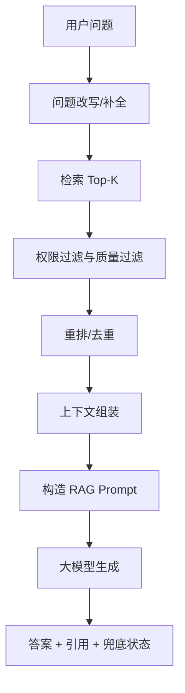

# 阶段八：RAG 检索增强生成

本阶段目标是理解 RAG，也就是 Retrieval-Augmented Generation：先从知识库检索相关资料，再把资料作为上下文交给大模型生成答案。

第六阶段解决“怎么检索相似文本”，第七阶段解决“知识库怎么构建”，第八阶段把它们串起来，形成一个能回答业务问题的完整链路。

## 本阶段你会学到什么

1. RAG 的核心流程和适用场景。
2. 检索策略如何影响答案质量。
3. 如何组装上下文、控制长度、保留引用。
4. 如何处理“知识库没有答案”的情况。
5. 如何做多路检索、重排、过滤和兜底。
6. Android、后端、前端在 RAG 应用里的分工。
7. 如何运行一个离线 RAG Demo。

## 章节目录

1. [RAG 基础与整体链路](./01-RAG基础与整体链路.md)
2. [检索策略、重排与上下文组装](./02-检索策略重排与上下文组装.md)
3. [引用、兜底、权限与工程边界](./03-引用兜底权限与工程边界.md)
4. [Demo：离线 RAG 问答流水线](./04-Demo-离线RAG问答流水线.md)

## 核心流程图

## 这一阶段最重要的观点

RAG 不是“检索到几段文字然后塞进 Prompt”这么简单。真正可用的 RAG 系统要回答：

1. 检索结果是否和问题相关？
2. 上下文是否足够回答？
3. 模型是否只基于上下文回答？
4. 回答是否能追溯来源？
5. 用户是否有权限看到这些资料？
6. 没有答案时是否会诚实兜底？

## 官方资料

- [Retrieval](https://developers.openai.com/api/docs/guides/retrieval)
- [File search](https://developers.openai.com/api/docs/guides/tools-file-search)
- [Vector embeddings](https://developers.openai.com/api/docs/guides/embeddings)
