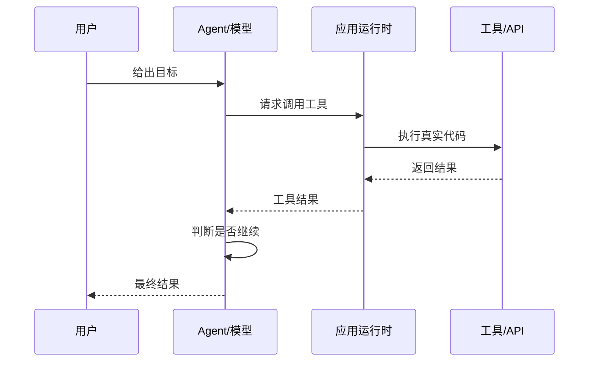

# Agent 基础与多步骤任务

Agent 可以理解为“带工具、带状态、能多轮决策的模型应用”。它不是让模型完全自由行动，而是把模型放进一个受控循环里。

## 普通聊天、RAG、Agent 的区别

| 类型 | 输入 | 过程 | 输出 |
| --- | --- | --- | --- |
| 普通聊天 | 用户问题 | 模型直接生成 | 一段答案 |
| RAG | 用户问题 + 检索上下文 | 检索后生成 | 带引用答案 |
| Agent | 用户目标 + 工具集合 + 状态 | 计划、调用工具、观察、继续决策 | 任务结果和执行 trace |

RAG 通常回答“是什么、怎么做”。Agent 更适合处理“帮我完成这件事”。

## Agent Loop

Agent 的核心是循环：

这和前面 Function Calling 的五步流程是一致的：模型请求工具，应用侧执行工具，再把结果交回模型。Agent 只是把这个过程系统化、可循环、可观测。

## 适合 Agent 的任务

适合 Agent 的任务通常有这些特征：

1. 需要多步操作。
2. 需要调用多个工具。
3. 中间结果会影响下一步。
4. 需要在执行过程中判断是否继续。
5. 需要 trace 和审计。

例子：

1. 根据崩溃摘要检索知识库，再创建跟进工单。
2. 根据接口错误查询日志、定位服务、生成排查报告。
3. 根据用户反馈检索 FAQ，判断是否需要转人工。
4. 根据代码变更生成测试建议，再触发测试任务。

## 不适合 Agent 的任务

这些任务不一定需要 Agent：

1. 单次文本总结。
2. 简单问答。
3. 固定表单填写。
4. 只需要一次 API 调用的任务。
5. 权限或风险很高但没有审批机制的任务。

不要为了“看起来智能”而上 Agent。能用普通 API、RAG 或固定工作流解决的问题，就先用更简单的方案。

## Android 开发者视角

在移动端场景里，Agent 通常不应该直接运行在 Android 客户端。更合理的边界是：

1. Android 端收集用户目标和上下文。
2. 后端负责鉴权、限流、工具调用和日志。
3. Agent 在后端或受控服务中运行。
4. Android 端展示执行进度、结果、引用和审批提示。

这样可以保护 API Key、内部系统权限和执行过程。
