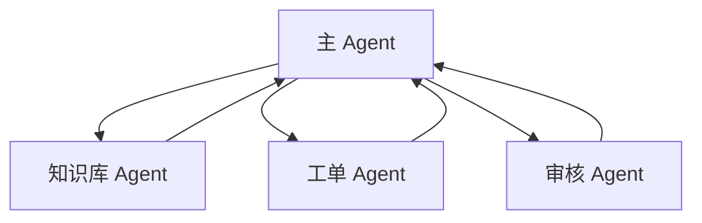
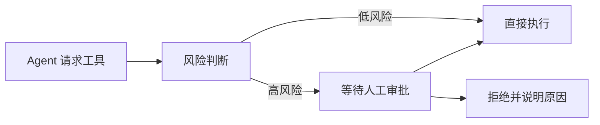

# 多 Agent、审批、Guardrails 与 Trace

单 Agent 足以覆盖很多任务。只有当职责、工具、权限或审批策略明显不同，才需要拆成多个 Agent。

## 什么时候拆多 Agent

可以考虑拆分的情况：

1. 不同专家需要不同工具。
2. 不同步骤有不同权限。
3. 某些动作必须人工审批。
4. 输出风格或目标明显不同。
5. 需要在 trace 中清楚看到责任边界。

例子：



主 Agent 负责最终答案，专业 Agent 作为工具或被 handoff 处理子任务。

## Handoff 和 Agent-as-tool

常见两种模式：

| 模式 | 含义 | 适合场景 |
| --- | --- | --- |
| Handoff | 把控制权交给另一个 Agent | 客服转人工、专业领域转接 |
| Agent-as-tool | 主 Agent 调用专家 Agent，最终仍由主 Agent 回答 | 主流程稳定，只需要专家辅助 |

OpenAI Agents SDK 文档也建议：当主 Agent 仍应负责最终答案时，可以把专家 Agent 作为工具使用。

## 审批

不是所有工具都应该自动执行。高风险动作需要审批：

1. 删除数据。
2. 修改线上配置。
3. 发送外部通知。
4. 创建费用相关订单。
5. 访问敏感资料。
6. 执行 shell 命令或代码变更。

审批可以发生在工具调用前：



## Guardrails

Guardrails 是运行时约束，不只是 Prompt。

常见约束：

1. 参数校验。
2. 权限校验。
3. 最大步数。
4. 最大花费。
5. 工具白名单。
6. 输出格式校验。
7. 敏感信息过滤。
8. 人工审批。

Prompt 可以提醒模型遵守规则，但真正的安全边界要在应用侧实现。

## Trace

Agent 必须记录 trace。没有 trace，就很难回答：

1. 为什么调用这个工具？
2. 工具传了什么参数？
3. 工具返回了什么？
4. 哪一步失败了？
5. 为什么最终答案这样写？

推荐 trace 至少包含：

```json
{
  "step": 1,
  "type": "tool_call",
  "tool_name": "search_knowledge_base",
  "arguments": {
    "query": "空指针崩溃怎么排查"
  },
  "result": {
    "ok": true
  }
}
```

OpenAI Agents SDK 提供了 tracing 能力，能记录模型调用、工具调用、handoff、guardrails 等信息。自建 Agent 也应该保留类似结构。
