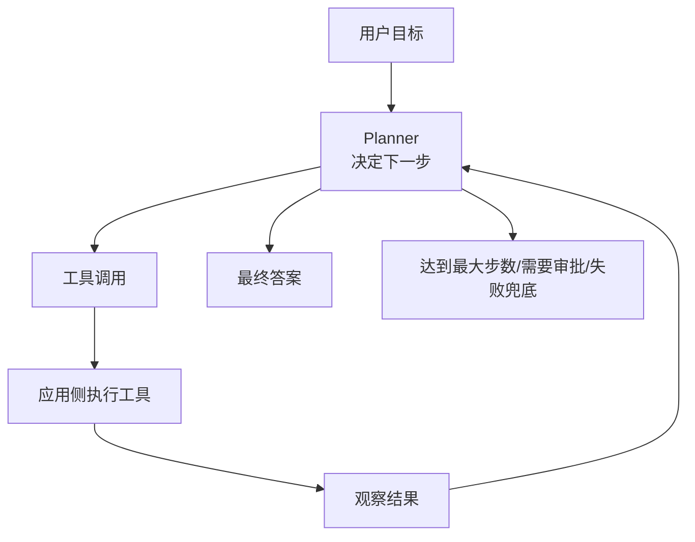

# 阶段九：Agent 与多步骤任务

本阶段目标是理解 Agent 的工程本质：模型不是只生成一段答案，而是在一个受控循环里进行计划、调用工具、读取结果、继续决策，直到完成任务或被规则停止。

前面阶段已经学过 API、结构化输出、工具调用、RAG。本阶段把这些能力组合成“多步骤任务执行”。

## 本阶段你会学到什么

1. Agent 和普通聊天、RAG 的区别。
2. 多步骤任务的 agent loop 是什么。
3. 工具、状态、记忆、审批和停止条件如何协作。
4. 什么时候用单 Agent，什么时候拆成多 Agent。
5. Agent 在 Android、后端、前端中的工程边界。
6. 如何记录 trace，排查 Agent 为什么这样做。
7. 如何运行一个离线多步骤 Agent Demo。

## 章节目录

1. [Agent 基础与多步骤任务](./01-Agent基础与多步骤任务.md)
2. [工具调用、状态与记忆](./02-工具调用状态与记忆.md)
3. [多 Agent、审批、Guardrails 与 Trace](./03-多Agent审批Guardrails与Trace.md)
4. [Demo：离线多步骤 Agent](./04-Demo-离线多步骤Agent.md)

## 核心流程图

## 和前面阶段的关系

Agent 不是替代 RAG，而是可以把 RAG 当成一个工具。比如：

1. 先调用知识库检索工具。
2. 再调用工单系统创建跟进任务。
3. 再调用通知工具发给负责人。
4. 最后总结执行结果给用户。

这类任务已经超出“问答”，进入“受控执行”的范畴。

## 官方资料

- [Agents SDK](https://developers.openai.com/api/docs/guides/agents)
- [Using tools](https://developers.openai.com/api/docs/guides/tools)
- [Function calling](https://developers.openai.com/api/docs/guides/function-calling)
- [Agents orchestration and handoffs](https://developers.openai.com/api/docs/guides/agents/orchestration)
- [Agents integrations and observability](https://developers.openai.com/api/docs/guides/agents/integrations-observability)
