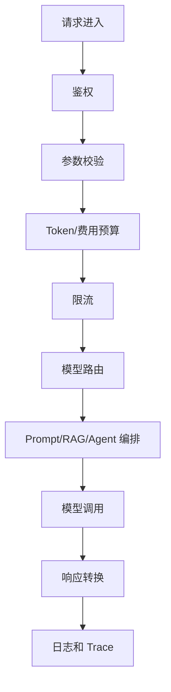

# 后端架构与请求生命周期

大模型后端的核心职责是把模型能力包装成稳定、安全、可观测、可控成本的业务服务。

## 为什么不建议客户端直连模型

Android 或 Web 前端不应该直接调用模型供应商 API，原因很实际：

1. API Key 不能暴露在客户端。
2. 客户端无法可靠做权限控制。
3. 成本预算和限流应该在服务端统一执行。
4. RAG、Agent、工具调用通常依赖内部系统。
5. 日志、审计和错误追踪需要后端统一记录。
6. 流式响应、重试、降级更适合由后端治理。

推荐结构是：客户端调用你的业务后端，由业务后端再调用模型、向量库、工具系统。

## 后端网关职责

大模型后端可以叫 LLM Gateway、AI Gateway、模型网关或 AI 编排服务。名字不重要，关键是它承担统一入口。

## 请求生命周期

一次请求通常经历这些步骤：

1. 接收请求：来自 Android、Web、后台任务或内部服务。
2. 鉴权：确认用户身份、租户、角色、额度。
3. 参数校验：检查输入长度、任务类型、输出格式。
4. 预算估算：估算输入 token 和最大输出 token。
5. 限流：按用户、租户、接口、模型维度限流。
6. 模型路由：选择快模型、强模型、长上下文模型或降级模型。
7. 编排：执行 Prompt、RAG、工具调用或 Agent loop。
8. 调模型：普通响应、流式响应或后台模式。
9. 结果处理：结构化解析、引用处理、错误兜底。
10. 记录日志：trace_id、模型、耗时、usage、错误码、脱敏后的输入摘要。

## 后端接口设计建议

不要一开始只做一个万能 `/chat`。可以按业务能力拆：

| 接口 | 用途 |
| --- | --- |
| `/ai/chat` | 通用聊天或轻量助手 |
| `/ai/rag/answer` | 知识库问答 |
| `/ai/agent/run` | 多步骤任务 |
| `/ai/prompts/render` | 调试 Prompt 模板 |
| `/ai/jobs/{id}` | 查询异步任务 |
| `/ai/usage` | 查询用户或租户用量 |

接口要返回稳定状态码和业务状态，例如 `ok`、`rate_limited`、`token_budget_exceeded`、`provider_timeout`、`no_answer`。

## Android 端需要什么

Android 端通常需要：

1. 请求 ID 或 trace_id。
2. 普通响应或流式增量。
3. 明确错误码。
4. 可重试标记。
5. 引用资料。
6. 任务状态。
7. 用户取消能力。

这意味着后端不要只返回一段自然语言，而要返回结构化结果。
