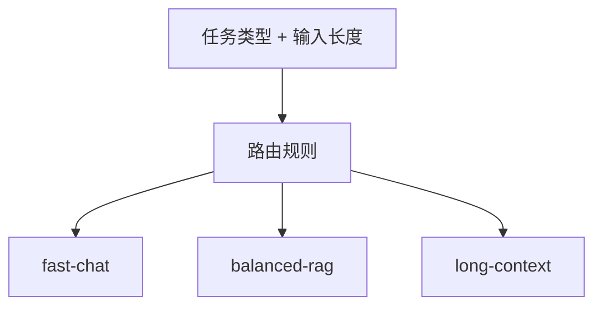

# 模型路由、限流、重试与降级

大模型调用是一个高成本、可失败、延迟不稳定的外部依赖。后端要像治理数据库、支付网关、短信服务一样治理它。

## 模型路由

模型路由是根据任务选择合适模型。

| 任务 | 推荐路由 |
| --- | --- |
| 简单聊天 | 快速低成本模型 |
| RAG 问答 | 平衡模型 |
| 长文档总结 | 长上下文模型 |
| 复杂 Agent | 推理能力更强的模型 |
| 批量离线任务 | 支持后台或批处理的路径 |

模型路由的目标不是永远选最强模型，而是在质量、延迟和成本之间取得平衡。



## Token 预算

后端需要在调用前估算 token：

1. 输入 token。
2. RAG 上下文 token。
3. 工具结果 token。
4. 最大输出 token。
5. 推理模型可能产生的 reasoning token。

如果估算值超过预算，应该提前拒绝或要求压缩上下文，而不是等供应商 API 报错。

## 限流

OpenAI 官方 Rate limits 文档说明，限制可能按请求数、token 数、模型、组织、项目等维度生效。你的业务后端也应该有自己的限流：

1. 用户级限流。
2. 租户级限流。
3. 接口级限流。
4. 高成本模型单独限流。
5. 后台批处理单独队列。

这样可以避免某个用户或任务把所有额度打满。

## 重试

适合重试的错误：

1. 短暂网络失败。
2. 超时。
3. 429 限流。
4. 5xx 服务端错误。

不适合直接重试的错误：

1. 参数错误。
2. 鉴权失败。
3. 内容策略拒绝。
4. 预算不足。
5. 明确的业务校验失败。

重试要使用指数退避和抖动，避免大量请求同时重试。OpenAI Rate limits 文档也建议对限流错误使用指数退避，但要注意失败请求本身也会计入限制。

## 降级

降级策略可以包括：

1. 强模型失败后切到低成本模型。
2. 关闭非核心工具调用。
3. 降低 Top-K 检索数量。
4. 缩短上下文。
5. 从流式响应切到后台任务。
6. 返回“稍后重试”或进入人工处理。

降级必须透明记录在 trace 中，否则后面很难解释为什么这次答案质量下降。

## 幂等性

如果模型调用后还会触发工具，比如创建工单、发通知、扣费，必须设计幂等键：

```text
idempotency_key = user_id + task_type + client_request_id
```

否则用户重试或网络抖动可能导致重复创建工单或重复执行动作。
