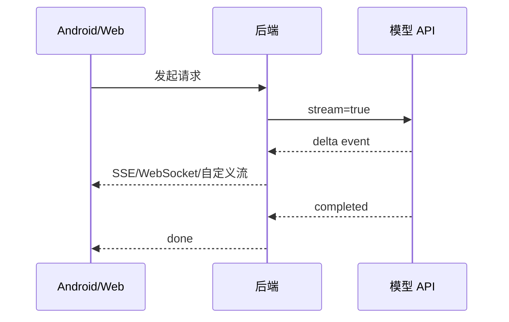

# 流式响应、异步任务与观测

大模型请求常见问题是慢。后端要根据任务类型选择普通响应、流式响应或后台任务。

## 普通响应

普通响应适合：

1. 输出较短。
2. 延迟可接受。
3. 不需要展示生成过程。
4. 任务不会超过网关超时。

例如分类、字段抽取、短文本改写。

## 流式响应

OpenAI Streaming 文档说明，Responses API 支持通过 SSE 流式返回语义事件。流式响应适合：

1. 聊天。
2. 长答案。
3. 需要用户尽快看到首 token。
4. Android 或 Web 要支持取消。



后端可以把模型供应商的事件转换成自己的稳定事件格式，避免客户端直接依赖供应商细节。

## 后台任务

OpenAI Background mode 文档说明，长任务可以用 `background=true` 异步执行，再轮询 response 状态。你的业务后端也可以封装类似能力：

1. 客户端提交任务。
2. 后端返回 `job_id`。
3. 客户端轮询或接收推送。
4. 后端支持取消任务。
5. 最终结果写入任务表。

适合后台模式的任务：

1. 长文档分析。
2. 多步骤 Agent。
3. 大批量知识库处理。
4. 报告生成。
5. 需要人工审批的任务。

## 会话状态

OpenAI Conversation state 文档提供了几种管理上下文的方式，例如手动传历史、使用 `previous_response_id`、使用 Conversations API。后端要决定哪种方式适合你的产品。

常见策略：

| 策略 | 优点 | 风险 |
| --- | --- | --- |
| 客户端传全量历史 | 简单 | 成本高、容易超上下文 |
| 后端保存摘要 | 成本可控 | 需要摘要质量 |
| 使用 previous_response_id | 简化续接 | 需要理解存储和计费边界 |
| 业务会话表 | 可控、可审计 | 实现成本更高 |

无论哪种方式，都要注意上下文窗口和输入 token 成本。

## 观测指标

上线后至少记录这些指标：

1. 请求量。
2. 成功率。
3. 首 token 延迟。
4. 总耗时。
5. 输入 token。
6. 输出 token。
7. 模型分布。
8. 错误码分布。
9. 降级次数。
10. 用户取消次数。

日志要脱敏。不要把 API Key、手机号、邮箱、身份证、完整请求参数直接写入日志。

## Trace

每次请求都应该有 `trace_id`。RAG 和 Agent 请求还要记录：

1. 检索 query。
2. 命中文档。
3. 工具调用。
4. 模型路由。
5. Prompt 版本。
6. 预算和实际 usage。
7. 降级或重试记录。

没有这些信息，线上问题会很难排查。

## Trace 示例：从 Android 点击发送到完成

下面是一条 Android 知识库助手请求的最小 Trace。它能帮助你回答“慢在哪里、错在哪里、是否降级过”。

```json
{
  "trace_id": "tr_20260710_001",
  "client_request_id": "android-20260710-001",
  "timeline": [
    {"step": "request_received", "at_ms": 0},
    {"step": "auth_checked", "at_ms": 8},
    {"step": "rate_limit_checked", "at_ms": 12},
    {"step": "retrieval_started", "at_ms": 20},
    {"step": "retrieval_completed", "at_ms": 88, "doc_ids": ["crash-guide#2", "lifecycle#4"]},
    {"step": "model_stream_started", "at_ms": 160, "model_alias": "balanced-rag"},
    {"step": "first_delta_sent", "at_ms": 430},
    {"step": "message_completed", "at_ms": 2100}
  ],
  "usage": {
    "input_tokens": 1420,
    "output_tokens": 260
  },
  "result": "success"
}
```

如果 Android 用户反馈“刚才那次没有引用资料”，你可以用 `trace_id` 直接看出是检索没命中、引用事件没发送，还是前端没有渲染 `message.citation`。
