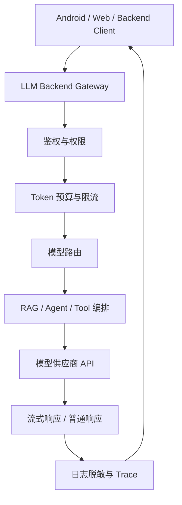

# 阶段十：大模型后端工程化

本阶段目标是理解“大模型能力如何作为后端服务稳定上线”。前面阶段已经学习 API、Prompt、结构化输出、RAG 和 Agent；这一阶段关注把这些能力放进真实后端系统时需要的工程治理。

大模型后端不是简单封装一个 `/chat` 接口，而是要处理鉴权、限流、模型路由、上下文管理、重试、流式响应、异步任务、日志脱敏、成本预算和可观测性。

## 本阶段你会学到什么

1. 大模型后端网关的职责。
2. 一次模型请求在后端的完整生命周期。
3. 如何做模型路由、预算控制和限流。
4. 如何处理超时、重试、降级和后台任务。
5. 如何向 Android/前端转发流式响应。
6. 如何记录 trace、usage、错误和安全日志。
7. 如何运行一个离线 LLM 后端网关 Demo。

## 章节目录

1. [后端架构与请求生命周期](./01-后端架构与请求生命周期.md)
2. [模型路由、限流、重试与降级](./02-模型路由限流重试与降级.md)
3. [流式响应、异步任务与观测](./03-流式响应异步任务与观测.md)
4. [Demo：离线 LLM 后端网关](./04-Demo-离线LLM后端网关.md)

## 核心流程图

## 和前面阶段的关系

后端工程化阶段不是新增一种模型能力，而是把已有能力变成可靠服务：

1. 大模型 API 基础：变成统一模型客户端。
2. Prompt Engineering：变成版本化模板和灰度策略。
3. Function Calling：变成后端工具执行器。
4. RAG：变成检索编排服务。
5. Agent：变成可观测、可审批、可停止的任务执行流。

## 官方资料

- [Responses API](https://developers.openai.com/api/docs/guides/responses)
- [Streaming API responses](https://developers.openai.com/api/docs/guides/streaming-responses)
- [Background mode](https://developers.openai.com/api/docs/guides/background)
- [Conversation state](https://developers.openai.com/api/docs/guides/conversation-state)
- [Rate limits](https://developers.openai.com/api/docs/guides/rate-limits)
