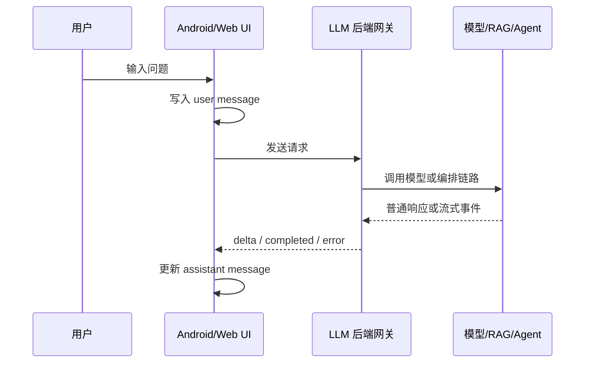

# AI 交互架构与消息模型

AI 前端的核心不是“做一个输入框和一个列表”，而是把长时间、不确定、可取消、可重试的模型任务表达成清晰的用户界面。

## 基本架构



前端不应该直接暴露模型 API Key，也不应该自己决定用户能访问哪些知识库。前端负责交互体验，后端负责鉴权、预算、检索、工具调用和模型调用。

## 消息模型

一个前端消息对象可以这样设计：

```json
{
  "id": "assistant-2",
  "role": "assistant",
  "content": "先看 FATAL EXCEPTION。",
  "status": "streaming",
  "traceId": "trace_123",
  "citations": [],
  "createdAt": 1783580000000
}
```

建议至少有这些字段：

| 字段 | 作用 |
| --- | --- |
| `id` | 前端稳定渲染 key |
| `role` | user / assistant / system / tool |
| `content` | 当前已生成文本 |
| `status` | waiting / streaming / completed / error / cancelled |
| `traceId` | 对应后端 trace |
| `citations` | RAG 引用 |
| `error` | 错误码和错误文案 |

## 为什么状态比文本重要

普通表单常见状态只有 loading 和 done。AI 交互至少需要：

1. `idle`：可输入。
2. `waiting`：请求已发出，尚未收到首个 token。
3. `streaming`：正在接收增量内容。
4. `completed`：生成完成。
5. `cancelled`：用户取消。
6. `error`：失败，可重试。

如果没有状态机，前端很容易出现按钮错乱、重复提交、取消无效、流式内容覆盖错误等问题。

## Android 与 Web 的共同点

无论是 Android Compose、传统 View、React、Vue 还是原生 JS，都应该先定义消息状态，再映射到 UI。

| 状态 | Android UI | Web UI |
| --- | --- | --- |
| waiting | 显示等待状态 | 禁用发送按钮 |
| streaming | 追加文本 | 追加 delta |
| error | 显示重试按钮 | 显示重试按钮 |
| cancelled | 保留已生成片段 | 保留已生成片段 |
| completed | 展示引用和操作 | 展示引用和操作 |

这就是“状态驱动 UI”的价值：交互规则集中在状态机里，而不是散落在按钮点击事件里。
