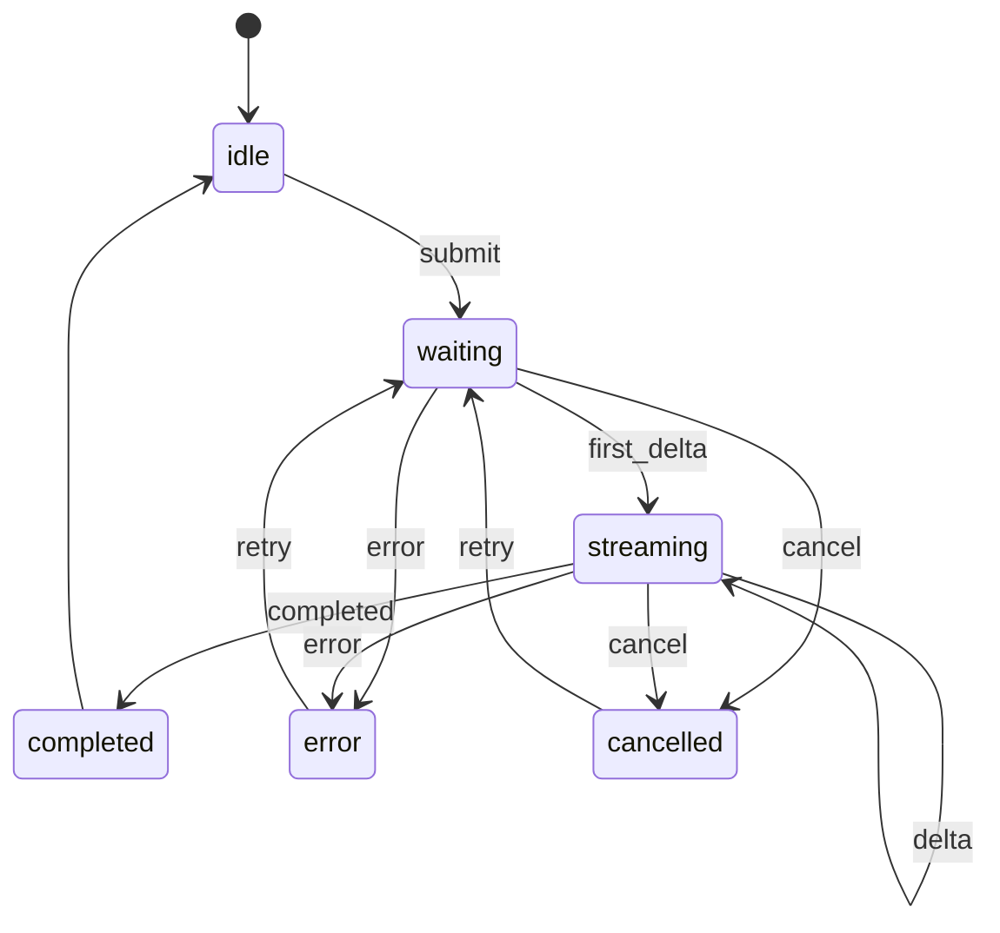

# 流式输出、取消、重试与状态机

流式输出是大模型应用最能影响体验的能力之一。OpenAI Streaming 文档说明，流式响应可以在完整输出生成前先开始处理模型输出，从而降低用户等待感。

## 流式事件

后端可以把模型供应商事件转换成统一事件：

```text
event: response.output_text.delta
data: 先看 FATAL EXCEPTION

event: response.completed
data: [DONE]
```

前端只关心稳定事件类型，不直接依赖供应商的全部细节。

## 状态机



这个状态机能回答：

1. 什么时候能发送？
2. 什么时候能取消？
3. 什么时候能重试？
4. delta 应该追加到哪条消息？
5. 失败后是否保留已生成内容？

## 消息状态机例子

贯穿项目里，每条 assistant 消息都应该有自己的状态，而不是只依赖页面级 `loading`。

| 消息状态 | 进入条件 | UI 行为 |
| --- | --- | --- |
| `queued` | 用户刚提交，后端还没返回 `message.started` | 显示等待中，创建临时 assistant 气泡 |
| `streaming` | 收到第一段 `message.delta` | 追加文本，显示取消按钮 |
| `completed` | 收到 `message.completed` | 显示引用、复制、反馈和重新生成 |
| `failed` | 收到 `response.error` 或网络失败 | 保留用户问题，显示错误和重试 |
| `cancelled` | 用户点击取消 | 停止追加，标记已取消，允许重新生成 |

例如 Android 崩溃分析里，用户提交日志后，前端先创建一条空 assistant 消息。后端返回 `message.started` 后绑定 `message_id`，后续所有 delta 只能追加到这条消息，不能凭“当前最后一条消息”猜测。

## 取消

取消不是只隐藏 loading。取消要做三件事：

1. 前端停止接收或忽略后续事件。
2. 后端尝试取消请求或标记任务取消。
3. UI 把当前 assistant message 标记为 `cancelled`。

如果后端不能真正中断模型调用，前端也要能忽略迟到事件，避免取消后又追加文本。

## 实战例子：取消后迟到 delta

一个容易出错的事件序列：

```text
1. 用户提交崩溃日志，前端创建 assistant message: asst_01
2. 后端返回 message.delta: "这个崩溃是空指针"
3. 用户点击取消，asst_01 状态变成 cancelled
4. 网络缓冲里又到达 message.delta: "，发生在 onCreate"
5. 后端最终返回 response.cancelled
```

第 4 步不能继续写入 UI。前端 reducer 可以按 `message_id + status` 判断：

```js
function applyDelta(state, event) {
  const message = state.messages.find((item) => item.id === event.messageId);
  if (!message || message.status !== "streaming") {
    return state;
  }
  message.content += event.text;
  return state;
}
```

这个规则也适用于用户切换会话、重新生成、页面恢复后的迟到事件。只要消息不是 `streaming`，delta 就不能改写它。

## 重试

重试要区分两种：

| 重试类型 | 行为 |
| --- | --- |
| 重新生成 | 保留用户消息，删除失败 assistant 消息，再发一次 |
| 继续生成 | 保留已有 assistant 内容，从断点或上下文继续 |

多数普通聊天先实现“重新生成”就够了。继续生成需要后端支持会话状态或 previous response 关联。

## 会话状态

OpenAI Conversation state 文档提供了多种方式管理多轮上下文，例如显式传历史、使用 `previous_response_id` 或 Conversations API。前端不要擅自无限保存和传输全部历史，应该和后端约定：

1. 前端保存展示所需消息。
2. 后端决定模型上下文如何裁剪。
3. 长会话要做摘要或分页。
4. 重新生成时要使用稳定 message id 或 trace id。

## Android 注意点

Android 端尤其要关注生命周期：

1. 页面销毁时取消请求。
2. 旋转屏幕或进后台时保留消息状态。
3. 网络断开时显示可恢复错误。
4. 流式追加要避免主线程大量重组。
5. 长文本渲染要考虑 RecyclerView/Compose LazyColumn 性能。

状态机越清晰，生命周期处理越容易。
