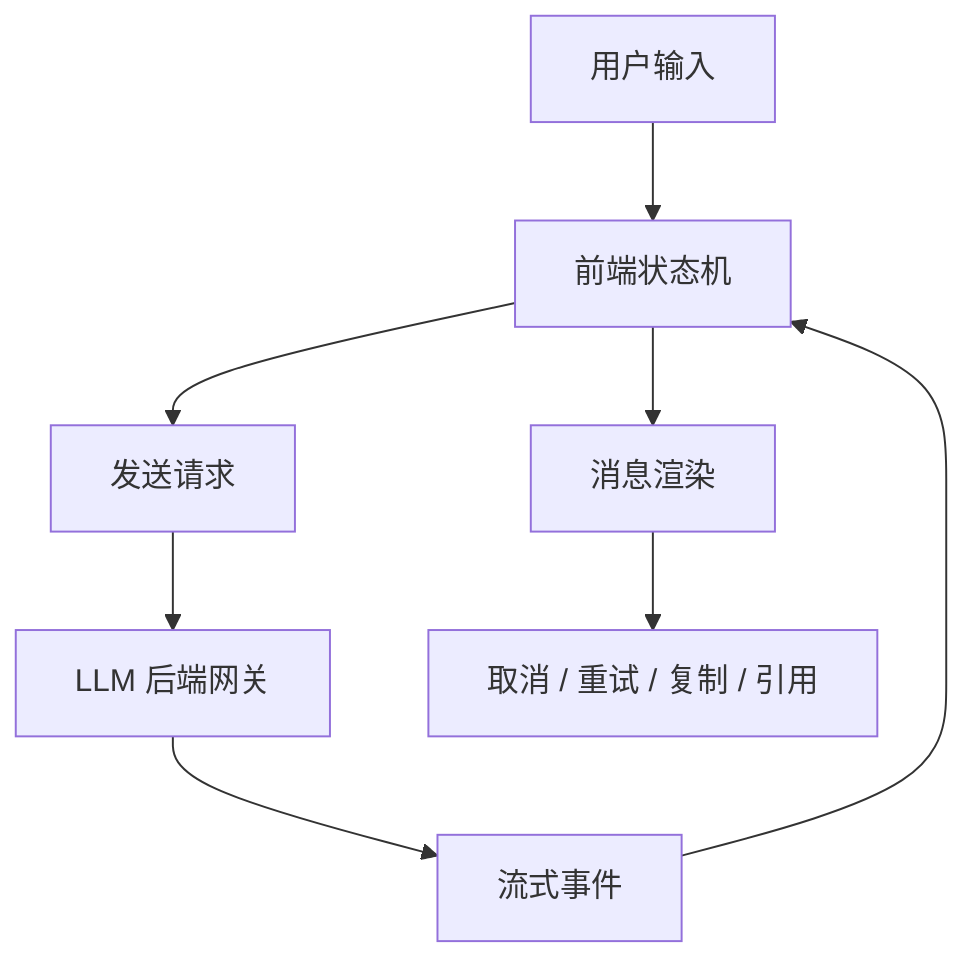

# 阶段十一：前端与交互体验

本阶段目标是理解“大模型应用在前端应该怎么呈现”。后端可以把模型、RAG、Agent 都封装好，但用户最终感受到的是页面状态、首字延迟、流式输出、取消、重试、引用、错误提示和多端一致性。

对 Android、Web、桌面端来说，AI 交互不是普通表单提交。它更像一个长时间运行的会话任务，需要清晰的状态机和可恢复体验。

## 本阶段你会学到什么

1. AI 聊天界面的消息模型和状态机。
2. 如何处理流式输出、取消、重试和失败恢复。
3. 如何展示 RAG 引用、工具调用和 Agent trace。
4. Markdown、代码块、表格、图片等内容如何渲染。
5. Web、Android、后端之间如何约定事件协议。
6. 何时使用 SSE、WebSocket、WebRTC 或普通 HTTP。
7. 如何运行一个静态 Chat UI 状态机 Demo。

## 章节目录

1. [AI 交互架构与消息模型](./01-AI交互架构与消息模型.md)
2. [流式输出、取消、重试与状态机](./02-流式输出取消重试与状态机.md)
3. [引用展示、富文本渲染与多端体验](./03-引用展示富文本渲染与多端体验.md)
4. [Demo：静态 Chat UI 状态机](./04-Demo-静态ChatUI状态机.md)

## 核心流程图

## 和前面阶段的关系

前端阶段承接第十阶段的后端网关：

1. 后端提供普通响应、流式响应或后台任务。
2. 前端把这些响应映射成稳定 UI 状态。
3. RAG 引用要变成可点击资料。
4. Agent trace 要变成用户能理解的进度。
5. 错误码要变成可恢复的交互。

## 本阶段练习

为 Android 知识库助手画出消息状态机，并补一组事件样例：正常流式、取消、取消后迟到 delta、引用到达、后端错误、重新生成。练习产物可以放到 [阶段练习与自检](../阶段练习与自检.md) 对应阶段下继续扩展。

## 和贯穿项目的关系

贯穿项目最终是否好用，主要体现在本阶段：用户提问、看到首字、取消生成、查看引用、复制答案、反馈错误。后端事件再完整，如果前端状态混乱，用户仍会感觉系统不可靠。

## 学完后的自检问题

1. 我能不能把后端流式事件映射成消息级状态，而不是只维护一个 `loading`？
2. 我能不能说明用户取消后迟到 delta 为什么必须被忽略？
3. 我能不能设计引用卡片和错误 UI，让用户知道下一步能做什么？

## 官方资料

- [Streaming API responses](https://developers.openai.com/api/docs/guides/streaming-responses)
- [Conversation state](https://developers.openai.com/api/docs/guides/conversation-state)
- [Realtime API with WebRTC](https://developers.openai.com/api/docs/guides/realtime-webrtc)
- [Realtime API with WebSocket](https://developers.openai.com/api/docs/guides/realtime-websocket)
- [Realtime conversations](https://developers.openai.com/api/docs/guides/realtime-conversations)
