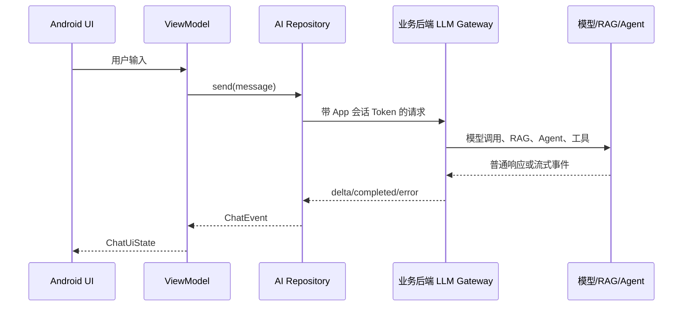

# Android 接入架构与安全边界

Android 接入大模型的第一原则：**不要把模型供应商 API Key 放进 App**。客户端发布后可以被反编译、抓包、调试，任何内置密钥都有泄露风险。

## 推荐架构



Android 端只持有 App 自己的登录态或会话 token，不持有 OpenAI API Key。

## 职责边界

| 层 | 职责 |
| --- | --- |
| Android UI | 展示消息、输入、按钮、引用、错误 |
| ViewModel | 管理状态、取消、重试、生命周期 |
| Repository | 调用后端、解析流式事件、错误转换 |
| 后端网关 | 鉴权、限流、模型路由、RAG、Agent、日志 |
| 模型服务 | 生成、工具调用、检索能力 |

这个边界能让 Android 端保持轻量，也方便后端统一治理成本、安全和权限。

## Android 请求格式

Android 端请求自己的后端：

```http
POST /ai/chat/stream
Authorization: Bearer <app-session-token>
Content-Type: application/json
Accept: text/event-stream

{
  "message": "空指针崩溃怎么排查",
  "stream": true
}
```

注意这里的 `Authorization` 是你的业务登录态，不是模型供应商密钥。

## 后端响应格式

可以约定 SSE 或自定义流式事件：

```text
event: message.started
data: {"traceId":"trace_123"}

event: message.delta
data: {"text":"先看 FATAL EXCEPTION"}

event: message.completed
data: {"citations":[{"label":"[android-crash-guide#0]"}]}
```

Android 端只需要解析稳定事件，不直接依赖模型供应商内部事件。

## 安全注意点

1. 不在 App 内写模型 API Key。
2. 不让 App 直接访问向量库。
3. 不在本地日志记录完整用户隐私和模型上下文。
4. 后端按用户权限过滤知识库。
5. Android 端只展示后端允许的引用。
6. 调试包和正式包分环境配置。
7. 对高风险 Agent 操作显示确认界面。

大模型应用不是“加一个聊天接口”这么简单，它会接触业务数据、用户输入和内部知识库，安全边界要先设计好。
