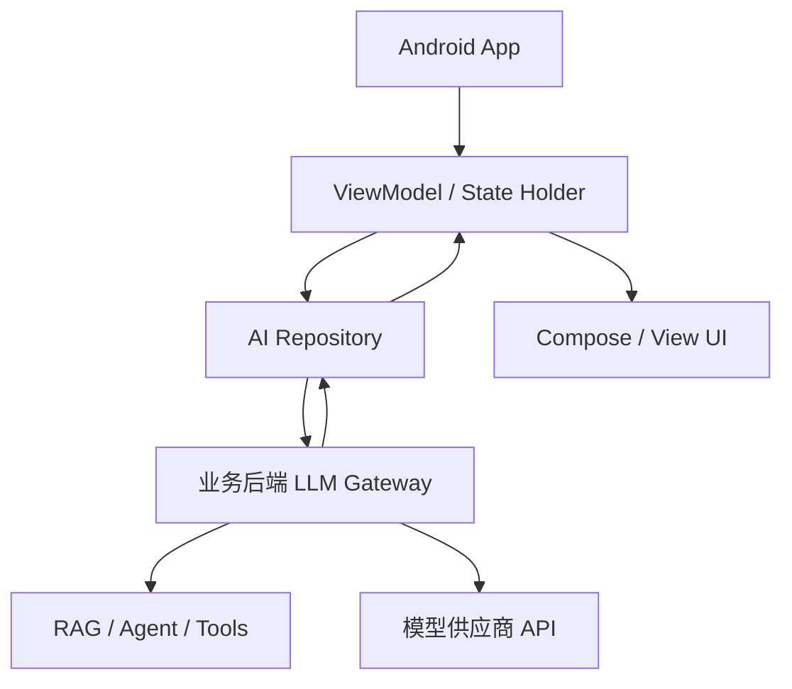

# 阶段十二：Android 端接入大模型

本阶段目标是理解 Android 应用如何安全、稳定、体验良好地接入大模型能力。重点不是在 App 里直接调用模型供应商 API，而是通过自己的后端网关接入聊天、RAG、Agent、流式输出和任务状态。

Android 端要关注的核心问题是：密钥安全、网络层、ViewModel 状态、生命周期取消、弱网重试、流式追加、引用展示和错误恢复。

## 本阶段你会学到什么

1. Android 端为什么不应该直连模型供应商。
2. Android、后端网关、模型服务之间的职责边界。
3. 如何设计聊天/RAG/Agent 的客户端状态。
4. 如何处理 SSE 或自定义流式事件。
5. 如何在 ViewModel 中管理发送、取消、重试和错误。
6. 如何处理弱网、页面销毁、后台切换和配置变化。
7. 如何运行一个离线 Android AI 客户端 Demo。

## 章节目录

1. [Android 接入架构与安全边界](./01-Android接入架构与安全边界.md)
2. [网络层、流式输出与生命周期](./02-网络层流式输出与生命周期.md)
3. [ViewModel 状态、错误恢复与体验细节](./03-ViewModel状态错误恢复与体验细节.md)
4. [Demo：离线 Android AI 客户端](./04-Demo-离线AndroidAI客户端.md)

## 核心流程图

## 和前面阶段的关系

Android 端承接前端与后端阶段：

1. 第十阶段的后端网关负责模型密钥、RAG、Agent 和权限。
2. 第十一阶段的前端状态机思想可以迁移到 Android ViewModel。
3. Android 端只处理用户输入、状态渲染、流式事件、取消和重试。

## 官方资料

- [Streaming API responses](https://developers.openai.com/api/docs/guides/streaming-responses)
- [Conversation state](https://developers.openai.com/api/docs/guides/conversation-state)
- [Realtime API with WebRTC](https://developers.openai.com/api/docs/guides/realtime-webrtc)
- [ViewModel overview](https://developer.android.com/topic/libraries/architecture/viewmodel)
- [State holders and UI state](https://developer.android.com/topic/architecture/ui-layer/stateholders)
- [Kotlin coroutines on Android](https://developer.android.com/kotlin/coroutines)
