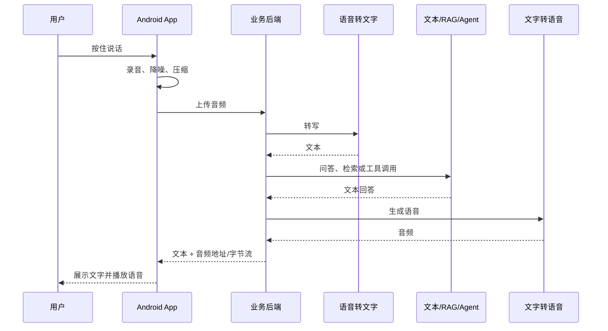
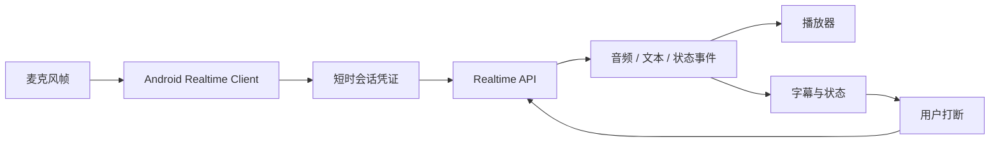

# 语音能力与实时会话基础

语音能力可以拆成三类：语音转文字、文字转语音、实时语音会话。它们看起来都和“声音”有关，但工程形态完全不同。

## 三种语音能力

| 能力 | 输入 | 输出 | 适合场景 | 工程特点 |
| --- | --- | --- | --- | --- |
| 语音转文字 | 音频文件或音频流 | 文本 | 会议纪要、语音搜索、录音整理 | 可以异步，适合走普通 HTTP 上传 |
| 文字转语音 | 文本 | 音频 | 播报、陪练、无障碍朗读 | 可以缓存，适合后端生成后返回 |
| 实时语音会话 | 麦克风音频 | 文本/音频事件 | 语音助手、陪练、低延迟问答 | 需要长连接、打断、重连和状态同步 |

普通语音助手可以先从“录音 -> 转写 -> 文本问答 -> 语音播报”开始。只有当你需要用户边说边打断、模型边听边回答、延迟接近通话体验时，才需要 Realtime。

## 普通语音链路



这条链路的优点是简单、稳定、好排查。它可以复用前面阶段的后端网关、RAG、Agent、结构化输出和日志系统。

## 实时语音链路

实时语音不是把普通 HTTP 请求变快一点，而是一次持续会话。客户端持续采集音频，服务端持续返回事件，模型可以发出文本、音频、状态、错误和工具调用事件。



实时语音要重点处理：

1. 会话凭证：Android 不保存模型密钥，只从后端拿短时凭证或会话配置。
2. 音频格式：客户端和服务端要约定采样率、编码、分片大小。
3. VAD：由客户端或服务端判断用户是否说完。
4. 打断：用户再次说话时，要停止当前播报并通知会话取消或截断。
5. 重连：网络切换、App 进后台、蓝牙设备切换都可能让会话中断。
6. 事件顺序：文本字幕、音频播放和最终回答状态可能不是同一时间到达。

## Android 端建议

先不要一上来做全双工实时语音。更稳妥的路线是：

1. 第一版：按住说话，上传完整录音，返回文本回答。
2. 第二版：在第一版基础上增加 TTS 播报。
3. 第三版：增加分片上传或流式转写，降低等待时间。
4. 第四版：再接 Realtime，实现打断、低延迟和持续会话。

这样做的好处是每一步都有清晰的可测边界。即使后面接入实时会话，前面的 STT/TTS 链路仍然可以作为降级方案。

## 后端接口草图

```http
POST /api/ai/speech/transcribe
Authorization: Bearer <app-session-token>
Content-Type: multipart/form-data

file=<audio>
```

```http
POST /api/ai/speech/speak
Authorization: Bearer <app-session-token>
Content-Type: application/json

{
  "text": "请用自然语气朗读这段回答"
}
```

```http
POST /api/ai/realtime/session
Authorization: Bearer <app-session-token>
Content-Type: application/json

{
  "scenario": "voice_assistant",
  "voice": "marin"
}
```

真实项目中，这些接口都应该由你的业务后端实现。Android 只拿业务 token，不拿模型供应商 API Key。
