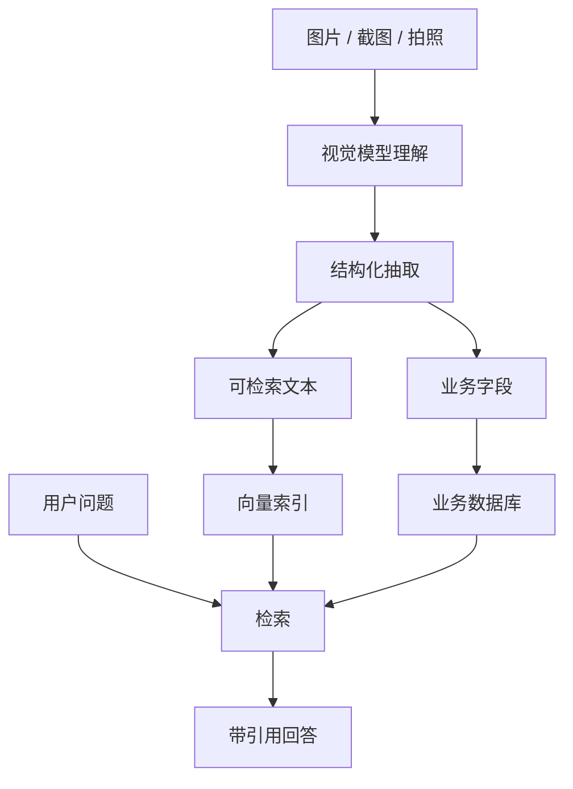

# 图片视觉与多模态输入输出

多模态里的“视觉”能力，最常见的是让模型同时接收文字和图片，然后输出文本、结构化 JSON、工具调用参数，或进入后续 RAG/Agent 流程。

## 图片能力能做什么

| 能力 | 例子 | 输出 |
| --- | --- | --- |
| 图片理解 | “这张截图哪里出错了？” | 问题分析、操作建议 |
| OCR 与字段抽取 | “识别这张发票里的金额和日期” | 结构化 JSON |
| UI/页面分析 | “这个页面为什么用户容易误操作？” | 交互问题列表 |
| 场景理解 | “这张照片里有哪些风险点？” | 风险描述 |
| 图文 RAG | “结合这张图和知识库回答” | 带引用回答 |
| 图片生成/编辑 | “生成一张产品宣传图” | 图片文件 |

应用开发里，最先落地的通常不是图片生成，而是图片理解：截图诊断、拍照识别、OCR、工单附件分析、学习辅导、质检巡检。

## Responses 图文输入结构

下面是一个简化的图文输入结构。Demo 里也会生成同样形态的 payload：

```json
{
  "model": "demo-multimodal-model",
  "input": [
    {
      "role": "user",
      "content": [
        {
          "type": "input_text",
          "text": "这张图有什么问题？"
        },
        {
          "type": "input_image",
          "image_url": "app://image/screenshot.png"
        }
      ]
    }
  ]
}
```

实际项目里，`image_url` 一般不直接指向手机本地路径。更常见的做法是：

1. Android 选择图片、截图或拍照。
2. Android 压缩、去除不必要的 EXIF 信息。
3. Android 上传到自己的业务后端或对象存储。
4. 后端做鉴权、风控、审计和临时访问地址。
5. 后端调用模型，并把结果返回给 Android。

## 图片进入 RAG 的方式

图片不能简单当成一段文本扔进向量库。更常见的做法是先把图片转成可检索、可审计的中间表示。



比如“拍照识别心理测评纸质表单”可以拆成：

1. 视觉模型识别表单内容。
2. 结构化输出姓名、题号、选项、备注。
3. 后端校验字段完整性。
4. 存入业务数据库。
5. 用户追问时再走 RAG 或普通数据库查询。

## 图片质量与隐私

图片链路要特别注意这些点：

1. 分辨率：太低会识别不准，太高会增加上传时间和成本。
2. 裁剪：截图诊断时，尽量只上传相关区域。
3. EXIF：拍照图片可能带位置、设备、时间等元信息。
4. 脱敏：身份证、病历、聊天记录、支付信息要做业务级保护。
5. 留存：默认不要长期保存原图，除非业务和用户授权明确需要。
6. 可追溯：模型输出最好保留图片版本、提示词版本、模型版本和调用日志。

## Android 端图片来源

| 来源 | 典型权限/能力 | 注意事项 |
| --- | --- | --- |
| 截图 | App 内截图能力 | 避免截到密码、token、隐私弹窗 |
| 相机拍照 | CAMERA | 处理旋转、压缩、失败重试 |
| 相册选择 | 系统照片选择器或媒体权限 | 优先用系统选择器减少权限压力 |
| 文件附件 | SAF / 文件选择器 | 做大小、格式、病毒和内容校验 |

工程上可以先把“图片理解”做成独立后端接口，再逐步接入 RAG、Agent 或结构化输出。这样每一步都能单独测试。

## 实战例子：上传崩溃截图

Android 崩溃日志智能分析工具可以允许用户上传截图，但链路要明确：

```text
用户选择 App 内截图
-> Android 裁剪到错误区域并压缩到目标尺寸
-> Android 去除 EXIF 和本地路径
-> Android 上传到 /api/ai/images
-> 后端返回 image_id 和临时访问地址
-> Android 调用 /api/chat，传入 image_id 和文字问题
-> 后端做视觉理解，抽取错误类型、包名、堆栈片段
-> 后端检索知识库并返回带引用答案
```

请求体可以这样表达图片和文字的关系：

```json
{
  "scenario": "android_crash_screenshot",
  "message": "这张截图里的崩溃应该怎么排查？",
  "images": [
    {
      "image_id": "img_20260710_001",
      "purpose": "crash_screenshot"
    }
  ]
}
```

注意不要让模型直接信任图片里的文字。截图 OCR 出来的内容可能包含用户隐私，也可能包含恶意指令，所以后端仍要做权限、脱敏、Prompt 隔离和输出校验。
