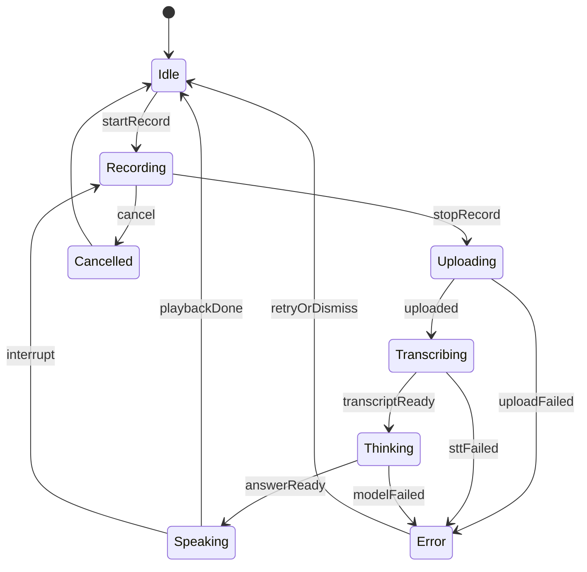

# Android 端语音多模态工程边界

Android 接入语音和多模态能力时，最大的原则仍然是：客户端负责采集、预处理、展示和播放；业务后端负责鉴权、密钥、审计、模型调用和数据治理。

## 职责划分

| 模块 | 负责什么 | 不负责什么 |
| --- | --- | --- |
| Android App | 权限申请、录音、拍照、选图、压缩、上传、播放、状态展示 | 保存模型密钥、绕过后端直连供应商 |
| 业务后端 | 鉴权、限流、文件接收、临时 URL、模型调用、日志、脱敏、成本控制 | 直接控制 UI 生命周期 |
| 模型服务 | 转写、合成、视觉理解、实时会话、推理 | 业务权限判断、用户会话管理 |

这条边界可以让你后续更容易做限流、审计、重试、灰度、供应商切换和合规处理。

## 权限与生命周期

语音和图片常见权限：

| 能力 | 常见权限 | 建议 |
| --- | --- | --- |
| 录音 / 实时语音 | RECORD_AUDIO | 用户点击录音时再申请，结束后立即释放 |
| 拍照 | CAMERA | 只在拍照入口申请，不在首页预申请 |
| 相册选择 | 系统照片选择器 / READ_MEDIA_IMAGES | 优先使用系统选择器，减少长期权限 |
| 文件附件 | 文件选择器 | 限制大小、格式和来源 |

生命周期要处理：

1. 页面销毁：停止录音、取消上传、释放播放器。
2. App 进入后台：停止实时会话或切到明确的后台策略。
3. 横竖屏/配置变化：不要丢失当前任务状态。
4. 网络切换：上传任务和实时会话要能失败恢复。
5. 蓝牙/耳机切换：实时语音要重新评估输入输出设备。

## 权限拒绝例子

权限拒绝不是异常情况，而是正常用户路径。贯穿项目里可以这样处理：

| 用户动作 | 权限结果 | 推荐 UI | 后续能力 |
| --- | --- | --- | --- |
| 点击语音提问 | 拒绝 `RECORD_AUDIO` | 停留在输入框，提示可改用文字提问 | 文本聊天仍可用 |
| 点击拍照分析 | 拒绝 `CAMERA` | 提供“从相册选择”入口 | 图片选择仍可用 |
| 从相册选图 | 用户取消选择器 | 回到当前会话，不显示错误 | 原输入保留 |
| 实时语音中切后台 | 麦克风被系统暂停 | 停止会话并提示重新连接 | 可降级为按住说话 |

不要在权限拒绝后反复弹系统授权框。用户主动再次点击语音或拍照入口时，再解释为什么需要权限。

## UI 状态机

语音多模态 UI 不建议只用一个 `loading`。至少要区分采集、上传、转写、思考、播报、错误和取消。



Realtime 场景还要加上 `Connecting`、`Connected`、`Reconnecting`、`Interrupted`、`SessionExpired` 等状态。

## Kotlin 状态骨架

```kotlin
sealed interface VoiceUiState {
    data object Idle : VoiceUiState
    data object Recording : VoiceUiState
    data object Uploading : VoiceUiState
    data class Transcribing(val partialText: String?) : VoiceUiState
    data class Thinking(val transcript: String) : VoiceUiState
    data class Speaking(val text: String, val audioUrl: String?) : VoiceUiState
    data class Error(val message: String, val retryable: Boolean) : VoiceUiState
}
```

这个状态骨架可以同时支撑普通语音链路和实时语音链路。区别是实时链路会收到更多事件，普通链路一般是请求完成后才进入下一步。

## 上传策略

语音和图片上传要考虑：

1. 大小限制：前端先拦截超大文件，后端再次校验。
2. 分片策略：长录音可以分片或先本地压缩。
3. 取消能力：用户取消后，客户端停止上传，后端停止后续模型调用。
4. 幂等 ID：重试时避免重复创建业务记录。
5. 结果回查：弱网下可以通过任务 ID 查询最终结果。
6. 日志脱敏：日志里不要直接写原始转写内容和图片 URL。

## 降级方案

实时语音是体验最好但工程最复杂的方案。上线时建议准备降级：

| 失败点 | 降级 |
| --- | --- |
| Realtime 会话创建失败 | 切回按住说话 + STT |
| TTS 生成失败 | 只展示文字回答 |
| 图片上传失败 | 允许重新选择或压缩后重试 |
| 视觉理解失败 | 保留用户文本问题，提示补充描述 |
| 网络不稳定 | 转为任务队列，完成后通知或刷新 |

多模态能力越强，越要把“用户能退出、能取消、能重试、能看懂发生了什么”做好。
