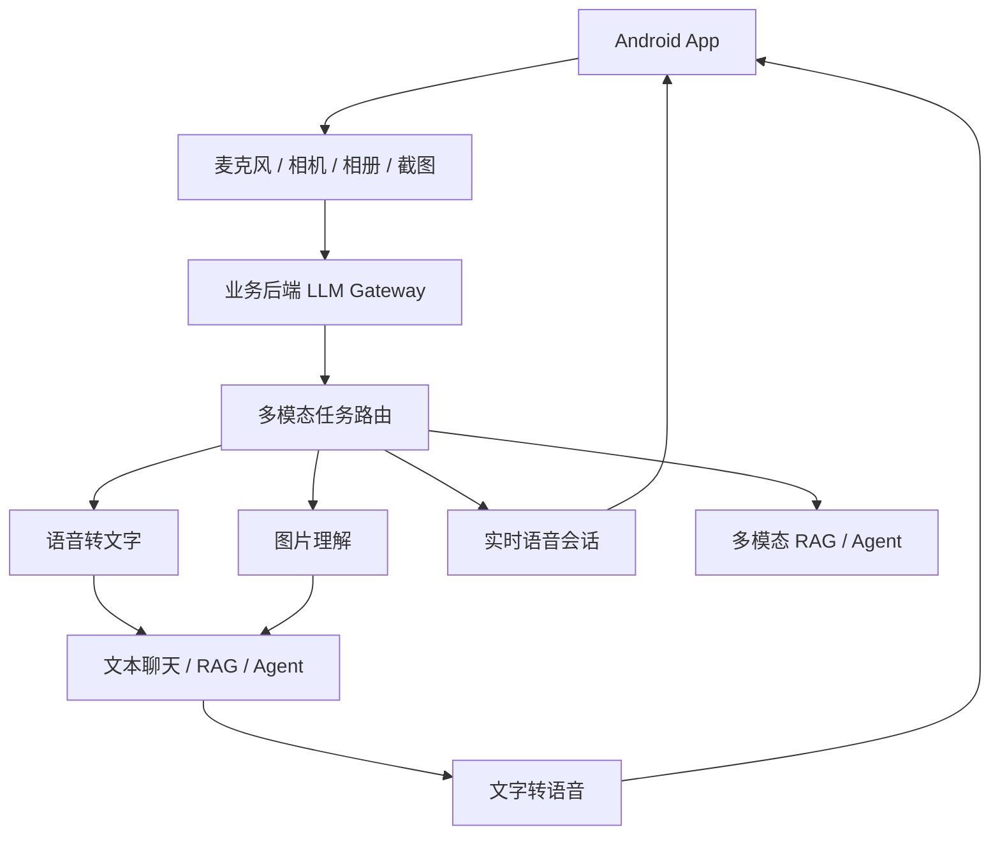

# 阶段十三：语音与多模态能力

本阶段目标是把前面已经掌握的文本聊天、RAG、Agent、前端/Android 接入能力，扩展到语音、图片和实时多模态交互。

对应用开发者来说，多模态不是“再学一个模型”，而是多了几类输入输出通道：麦克风、扬声器、相机、相册、截图、文件、实时连接。真正的难点通常在工程边界：权限、延迟、上传、隐私、取消、打断、弱网、生命周期和后端网关。

## 本阶段你会学到什么

1. 语音转文字、文字转语音、实时语音会话分别适合什么场景。
2. 图片理解、截图分析、OCR、图文问答和多模态 RAG 的差异。
3. Android 端处理麦克风、相机、相册、上传和生命周期的边界。
4. 后端如何承接语音/图片素材，避免客户端暴露模型密钥。
5. 如何设计实时语音交互中的状态、打断、重连和错误恢复。
6. 如何运行一个离线语音与多模态流水线 Demo。

## 章节目录

1. [语音能力与实时会话基础](./01-语音能力与实时会话基础.md)
2. [图片视觉与多模态输入输出](./02-图片视觉与多模态输入输出.md)
3. [Android 端语音多模态工程边界](./03-Android端语音多模态工程边界.md)
4. [Demo：离线语音与多模态流水线](./04-Demo-离线语音与多模态流水线.md)

## 核心流程图

## 常见场景选择

| 场景 | 推荐能力 | 典型链路 |
| --- | --- | --- |
| 录音整理会议纪要 | 语音转文字 | Android 录音 -> 后端转写 -> 摘要/结构化输出 |
| App 内语音助手 | 语音转文字 + 文本链路 + 文字转语音 | 录音 -> STT -> RAG/Agent -> TTS |
| 类似语音通话的助手 | Realtime | Android 获取短时会话 -> 实时音频双向传输 |
| 截图问题诊断 | 图片理解 | 截图/选图 -> 文本问题 + 图片 -> 模型分析 |
| 拍照识别业务资料 | 图片理解 + RAG | 图片理解 -> 结构化字段 -> 检索/校验 |
| 看图查知识库 | 多模态 RAG | 图片/文本 -> 检索 -> 带引用回答 |

## 和前面阶段的关系

1. 阶段二的大模型 API 基础提供请求/响应/流式的底层认知。
2. 阶段四的结构化输出适合承接 OCR、图片理解后的字段抽取。
3. 阶段八的 RAG 可以接收语音转写文本或图片理解结果。
4. 阶段十二的 Android 网关边界仍然成立：模型密钥不进入 App。

## 本阶段练习

为 Android 知识库助手设计两条多模态链路：`录音 -> 转写 -> RAG -> TTS` 和 `截图/图片 -> 视觉理解 -> 引用回答`。练习里要写出权限拒绝、上传失败、用户取消和 Realtime 降级策略。练习产物可以放到 [阶段练习与自检](../阶段练习与自检.md) 对应阶段下继续扩展。

## 和贯穿项目的关系

贯穿项目可以从纯文本助手扩展成语音提问、截图诊断和崩溃截图分析。语音和图片只是新的输入通道，仍然要经过后端网关、RAG、评估、监控和安全边界。

## 学完后的自检问题

1. 我能不能判断普通 STT/TTS 链路和 Realtime 分别适合什么体验？
2. 我能不能说明图片上传前后要处理哪些隐私、尺寸和权限问题？
3. 我能不能为录音、图片和实时会话分别设计取消、重试和降级方案？

## 官方资料

- [Audio and speech](https://developers.openai.com/api/docs/guides/audio)
- [Speech to text](https://developers.openai.com/api/docs/guides/speech-to-text)
- [Text to speech](https://developers.openai.com/api/docs/guides/text-to-speech)
- [Images and vision](https://developers.openai.com/api/docs/guides/images-vision)
- [Realtime and audio](https://developers.openai.com/api/docs/guides/realtime)
- [Realtime API with WebRTC](https://developers.openai.com/api/docs/guides/realtime-webrtc)
- [Realtime API with WebSocket](https://developers.openai.com/api/docs/guides/realtime-websocket)
