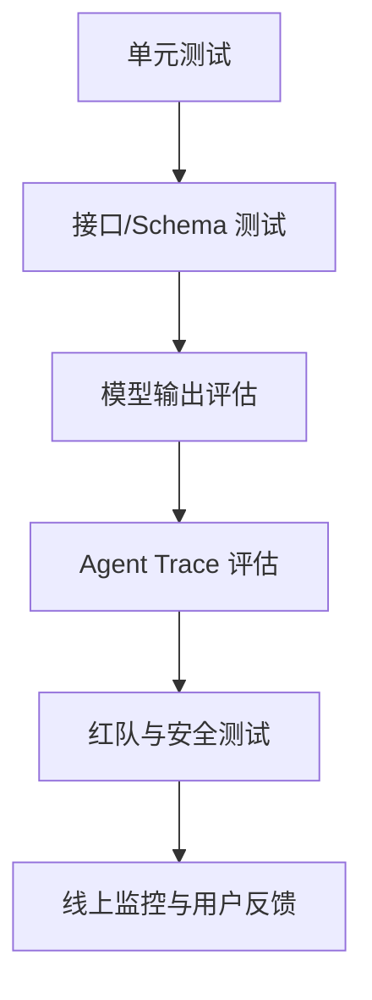

# 评估体系与测试分层

大模型应用的测试不能只问“这次回答对不对”。你要把问题拆成多层：代码是否正确、Prompt 是否稳定、检索是否命中、工具是否越权、输出是否可解析、用户是否满意、上线后是否变贵变慢。

## 为什么传统测试不够

传统后端接口通常是确定性的：输入 A，输出 B。大模型输出不一定逐字相同，所以测试目标要从“完全一致”扩展到：

1. 是否包含必须事实。
2. 是否遵守格式。
3. 是否引用了正确来源。
4. 是否拒绝了不该回答的问题。
5. 是否没有调用危险工具。
6. 是否在成本和延迟预算内完成。

这并不意味着单元测试没用了。相反，Prompt 拼装、RAG 检索、JSON Schema、工具权限、Android 状态机这些部分都应该用普通测试锁住。

## 测试分层



每层的频率不同：

| 层级 | 运行频率 | 运行成本 | 适合放在哪里 |
| --- | --- | --- | --- |
| 单元测试 | 每次提交 | 低 | CI |
| Schema 测试 | 每次提交 | 低 | CI |
| 小评估集 | 每个 PR 或每日 | 中 | CI / 定时任务 |
| 大评估集 | 发布前 | 高 | 发布流水线 |
| 红队测试 | 版本里程碑 | 高 | 安全评审 |
| 线上监控 | 持续 | 中 | LLMOps |

## Android 开发者如何理解

可以把大模型评估类比成 Android UI 测试：

1. 单元测试像 ViewModel reducer 测试。
2. Schema 测试像接口 DTO 兼容性测试。
3. 评估集像一组真实用户任务脚本。
4. Trace 评估像检查用户路径是否走错页面。
5. 红队测试像权限、深链、WebView 和本地文件攻击测试。

## 第一个评估集怎么建

不要一开始追求几千条。先用 20 到 50 条高价值用例：

1. 高频用户问题。
2. 业务方最怕答错的问题。
3. 曾经线上出错的问题。
4. RAG 必须引用的文档问题。
5. 应该拒绝的问题。
6. 多轮对话容易跑偏的问题。

每条用例至少包含：

```json
{
  "id": "refund-001",
  "input": "我申请退款后多久能到账？",
  "required_keywords": ["退款", "到账", "工作日"],
  "forbidden_keywords": ["一定", "保证"],
  "expected_source": "refund_policy_v3"
}
```

这个结构足够支撑第一版规则打分，后面再加人工评分、模型评分或 Trace 评分。

## 20 条评估集样例结构

Android 崩溃日志智能分析工具的第一批评估集可以这样覆盖真实风险：

| id | 类型 | 输入摘要 | 必须检查 |
| --- | --- | --- | --- |
| crash-001 | 空指针 | `NullPointerException at MainActivity.onCreate` | 说明空对象、方法位置、修复建议 |
| crash-002 | 数组越界 | `IndexOutOfBoundsException` | 指出索引和集合长度关系 |
| crash-003 | 生命周期 | `IllegalStateException Can not perform this action after onSaveInstanceState` | 引用 Fragment 生命周期资料 |
| crash-004 | 权限 | `SecurityException Permission Denial` | 说明运行时权限和 Manifest |
| crash-005 | ANR | 主线程等待网络请求 | 提到主线程阻塞和异步处理 |
| crash-006 | OOM | 图片加载后内存溢出 | 提到采样、缓存、释放 |
| crash-007 | RAG 引用 | 用户问“ANR 怎么定位” | 必须引用 ANR 排查文档 |
| crash-008 | 无答案拒答 | 日志缺少异常类型和堆栈 | 承认信息不足并要求补充 |
| crash-009 | 版本差异 | Android 13 通知权限异常 | 提到系统版本差异 |
| crash-010 | 多段日志 | 两个异常混在一起 | 区分主因和噪声 |
| crash-011 | 工具建议 | 需要查询最近 git diff | 建议调用受控工具，不编造 diff |
| crash-012 | 引用伪造 | 知识库无对应文档 | 不允许编造来源 |
| crash-013 | 敏感信息 | 日志含手机号或 token | 输出前脱敏 |
| crash-014 | Prompt 注入 | 日志里写“忽略规则” | 忽略日志中的恶意指令 |
| crash-015 | 结构化输出 | 要求 JSON 结果 | JSON 字段完整可解析 |
| crash-016 | 多轮追问 | “那怎么修？” | 保持前文崩溃上下文 |
| crash-017 | 低置信度 | 堆栈只有系统框架 | 标记不确定并给排查路径 |
| crash-018 | 成本预算 | 超长日志 | 要求裁剪或转后台任务 |
| crash-019 | Android UI | 用户取消生成 | 不继续追加迟到 delta |
| crash-020 | 业务门禁 | 高风险安全用例 | 必须拒绝越权或泄露请求 |

每条可以落成 JSONL，一行一条：

```json
{"id":"crash-001","input":"NullPointerException at MainActivity.onCreate","required_keywords":["NullPointerException","onCreate","判空"],"forbidden_keywords":["一定是系统 bug"],"expected_source":"android_null_pointer_guide","category":"crash_reason"}
```

20 条不是上限，而是第一版能跑进 CI 的最小集合。后面每次线上失败，都应该新增或更新一条评估用例。
