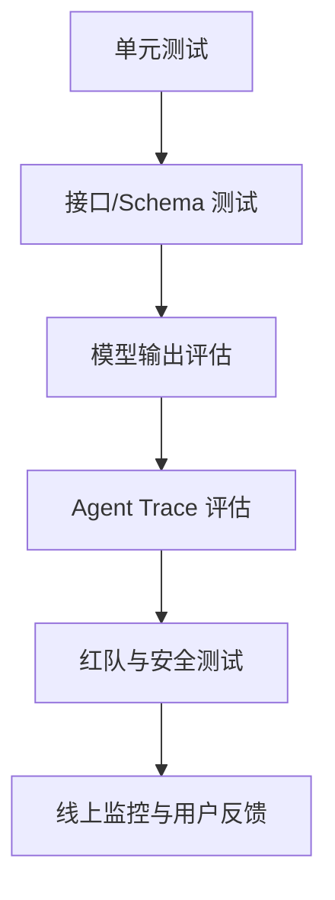

# 评估体系与测试分层

大模型应用的测试不能只问“这次回答对不对”。你要把问题拆成多层：代码是否正确、Prompt 是否稳定、检索是否命中、工具是否越权、输出是否可解析、用户是否满意、上线后是否变贵变慢。

## 为什么传统测试不够

传统后端接口通常是确定性的：输入 A，输出 B。大模型输出不一定逐字相同，所以测试目标要从“完全一致”扩展到：

1. 是否包含必须事实。
2. 是否遵守格式。
3. 是否引用了正确来源。
4. 是否拒绝了不该回答的问题。
5. 是否没有调用危险工具。
6. 是否在成本和延迟预算内完成。

这并不意味着单元测试没用了。相反，Prompt 拼装、RAG 检索、JSON Schema、工具权限、Android 状态机这些部分都应该用普通测试锁住。

## 测试分层



每层的频率不同：

| 层级 | 运行频率 | 运行成本 | 适合放在哪里 |
| --- | --- | --- | --- |
| 单元测试 | 每次提交 | 低 | CI |
| Schema 测试 | 每次提交 | 低 | CI |
| 小评估集 | 每个 PR 或每日 | 中 | CI / 定时任务 |
| 大评估集 | 发布前 | 高 | 发布流水线 |
| 红队测试 | 版本里程碑 | 高 | 安全评审 |
| 线上监控 | 持续 | 中 | LLMOps |

## Android 开发者如何理解

可以把大模型评估类比成 Android UI 测试：

1. 单元测试像 ViewModel reducer 测试。
2. Schema 测试像接口 DTO 兼容性测试。
3. 评估集像一组真实用户任务脚本。
4. Trace 评估像检查用户路径是否走错页面。
5. 红队测试像权限、深链、WebView 和本地文件攻击测试。

## 第一个评估集怎么建

不要一开始追求几千条。先用 20 到 50 条高价值用例：

1. 高频用户问题。
2. 业务方最怕答错的问题。
3. 曾经线上出错的问题。
4. RAG 必须引用的文档问题。
5. 应该拒绝的问题。
6. 多轮对话容易跑偏的问题。

每条用例至少包含：

```json
{
  "id": "refund-001",
  "input": "我申请退款后多久能到账？",
  "required_keywords": ["退款", "到账", "工作日"],
  "forbidden_keywords": ["一定", "保证"],
  "expected_source": "refund_policy_v3"
}
```

这个结构足够支撑第一版规则打分，后面再加人工评分、模型评分或 Trace 评分。
