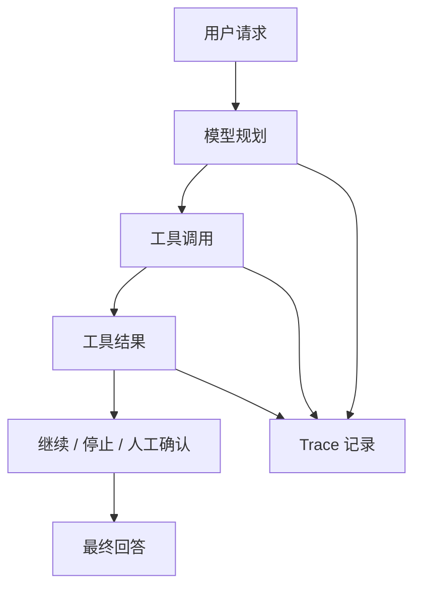

# Android、后端与 Agent 的测试落点

大模型评估不只发生在模型层。Android、后端网关、RAG、Agent、工具和运营平台都各有测试落点。

## Android 端

Android 端重点测状态和体验：

1. 发送中不能重复提交。
2. 用户取消后，迟到的流式 delta 不能继续写入 UI。
3. 断网后能展示可理解的错误。
4. 重新进入页面后能恢复任务状态。
5. 引用、图片、语音和文本不会错位。
6. 权限拒绝后不会进入死循环。

这些不需要真实模型，可以用假流式事件和假后端响应测试。

## 后端网关

后端重点测边界：

1. API Key 不会返回给客户端。
2. 用户只能访问自己有权限的知识库。
3. 超时、重试、限流和熔断正常。
4. 请求日志脱敏。
5. 结构化输出解析失败时有降级。
6. 成本和 token 统计完整。

## RAG

RAG 要分开测检索和生成：

| 测试 | 目标 |
| --- | --- |
| 检索召回率 | 用户问题能否找到正确文档 |
| 引用准确率 | 回答是否引用真实来源 |
| 上下文污染 | 错误文档是否影响回答 |
| 无答案拒答 | 知识库没有内容时是否承认不知道 |

## Agent

Agent 最容易在过程上出错，所以要记录 Trace：

Trace 评估可以检查：

1. 是否调用了正确工具。
2. 是否越权访问。
3. 是否在工具失败后继续胡编。
4. 是否在高风险动作前请求人工确认。
5. 是否重复调用工具造成成本浪费。

## 发布节奏

建议把评估接到发布流程：

1. PR：跑单元测试、Schema 测试、小评估集。
2. 合并后：跑完整评估集和安全用例。
3. 灰度前：对比上一版本质量、成本、延迟。
4. 灰度中：观察真实用户反馈和失败样例。
5. 全量前：确认无高危失败。
