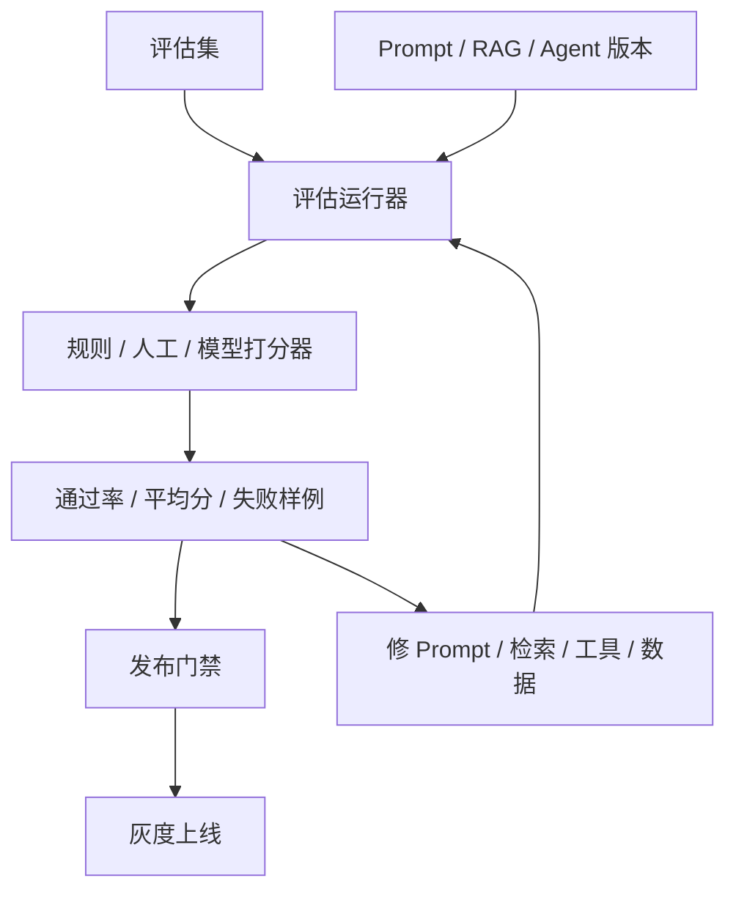

# 阶段十四：大模型评估与测试

本阶段目标是把“大模型回答看起来不错”变成“有数据、有用例、有门禁、有回归记录”。传统单元测试仍然重要，但大模型输出具有不确定性，所以还需要评估集、打分器、人工抽检、红队用例和线上观测。

注意：OpenAI 官方文档显示，Evals 平台正在进入弃用过渡期，现有内容会在 2026 年 10 月 31 日变为只读，并计划在 2026 年 11 月 30 日关闭。这里学习的是通用评估方法和工程闭环，不把课程绑定到某一个即将变化的平台界面。

## 本阶段你会学到什么

1. 为什么大模型应用不能只靠“人工试几条”上线。
2. 如何设计代表真实业务问题的评估集。
3. 如何区分规则打分、人工打分、模型打分和 Trace 打分。
4. 如何做 Prompt、RAG、Agent、Android 端体验的回归测试。
5. 如何把评估结果接入 CI、灰度和发布门禁。
6. 如何运行一个离线评估 Harness Demo。

## 章节目录

1. [评估体系与测试分层](./01-评估体系与测试分层.md)
2. [评估集、打分器与回归门禁](./02-评估集打分器与回归门禁.md)
3. [Android、后端与 Agent 的测试落点](./03-Android后端与Agent的测试落点.md)
4. [Demo：离线评估 Harness](./04-Demo-离线评估Harness.md)

## 核心流程图

## 评估优先级

| 层级 | 解决什么问题 | 例子 |
| --- | --- | --- |
| 单元测试 | 确认代码逻辑稳定 | prompt 拼装、JSON 解析、权限判断 |
| Golden 用例 | 确认关键业务回答不退化 | 客服 FAQ、政策解释、表单填写 |
| RAG 评估 | 确认检索和引用有效 | 是否命中正确文档、是否引用来源 |
| Agent Trace 评估 | 确认多步骤决策正确 | 是否调用正确工具、是否越权 |
| 红队测试 | 找安全和滥用边界 | Prompt 注入、敏感信息泄露 |
| 线上观测 | 确认真实用户体验 | 成本、延迟、失败率、人工反馈 |

## 本阶段练习

为 Android 崩溃日志智能分析工具写一份 20 条小评估集，覆盖空指针、ANR、权限异常、RAG 引用、无答案拒答和安全拒绝，并设计通过率、引用准确率、成本和延迟门禁。练习产物可以放到 [阶段练习与自检](../阶段练习与自检.md) 对应阶段下继续扩展。

## 和贯穿项目的关系

贯穿项目每次改 Prompt、换模型、更新知识库或调整工具，都要用评估集证明没有退化。评估不是额外文档，而是 Android 知识库助手能否持续迭代的发布门禁。

## 学完后的自检问题

1. 我能不能把一个“回答不好”的问题归因到 Prompt、检索、数据、模型或工具？
2. 我能不能解释为什么 20 条高价值用例比随手试 20 次更可靠？
3. 我能不能设计一个门禁，让安全失败或引用退化时阻止发布？

## 官方资料

- [Evaluation best practices](https://developers.openai.com/api/docs/guides/evaluation-best-practices)
- [Model optimization](https://developers.openai.com/api/docs/guides/model-optimization)
- [Trace grading](https://developers.openai.com/api/docs/guides/trace-grading)
- [Evaluate agent workflows](https://developers.openai.com/api/docs/guides/agent-evals)
- [Red teaming](https://developers.openai.com/api/docs/guides/red-teaming)
