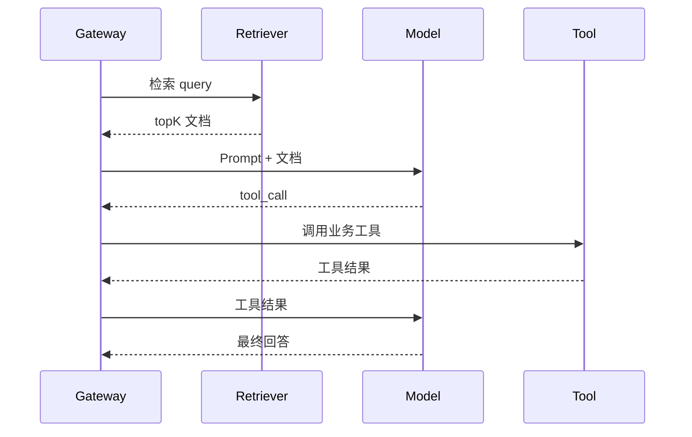

# 可观测性、日志与 Trace

LLMOps 的第一步是看得见。没有日志、指标和 Trace，你只能靠用户截图和主观感受排查问题。

## 三类观测数据

| 类型 | 解决什么问题 | 示例 |
| --- | --- | --- |
| Metrics | 系统是否健康 | 成本、延迟、错误率、token |
| Logs | 某次请求发生了什么 | 请求 ID、用户 ID、模型、错误码 |
| Trace | 多步骤链路怎么走的 | 检索、工具调用、模型输出、人工确认 |

普通聊天可以先做 Metrics 和 Logs。RAG 和 Agent 必须补 Trace，因为错误经常发生在中间步骤。

## 日志字段建议

```json
{
  "request_id": "req_20260709_001",
  "user_id_hash": "u_93ad",
  "route": "rag_chat",
  "prompt_version": "pv_14",
  "retriever_version": "rv_8",
  "model": "model_x",
  "input_tokens": 1200,
  "output_tokens": 240,
  "latency_ms": 1800,
  "cost_usd": 0.012,
  "status": "success"
}
```

不要把原始用户隐私、完整 Prompt、API Key、内部系统提示词直接写入日志。生产日志应该默认脱敏。

## Trace 的价值

Agent 或 RAG 出错时，最终回答通常只告诉你“结果错了”，Trace 才能告诉你“哪里错了”。



Trace 里要能看到：

1. 检索 query。
2. 命中文档 ID。
3. 工具名和参数摘要。
4. 工具返回状态。
5. 模型输出片段。
6. 每一步耗时。

## Android 端关联

Android 请求后端时应该带上业务请求 ID 或让后端返回请求 ID。用户反馈“刚才那次回答不对”时，你能根据请求 ID 找到后端日志和 Trace。

建议 UI 上对失败请求保留：

1. requestId。
2. 时间。
3. 场景。
4. 错误码。
5. 是否可重试。

这会极大降低排查成本。
