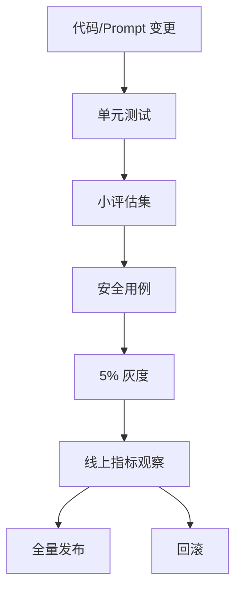

# 灰度发布、告警与事故复盘

大模型应用的发布对象不只有代码，还包括 Prompt、模型、RAG 索引、工具 Schema、评估集和安全策略。任何一个变化都可能改变线上行为。

## 版本对象

建议把这些都版本化：

1. `prompt_version`
2. `model_alias`
3. `retriever_version`
4. `knowledge_base_version`
5. `tool_schema_version`
6. `guardrail_version`
7. `eval_set_version`

灰度时，日志必须能看出用户命中了哪个组合。

## 发布门禁

一个实用门禁可以长这样：

门禁要同时看质量和运营指标：

1. 评估通过率不能下降超过阈值。
2. 高危安全用例不能失败。
3. P95 延迟不能明显变差。
4. 单请求成本不能失控。
5. 用户负反馈不能异常升高。

## 告警设计

不要对所有指标都设置很敏感的告警，否则很快没人看。建议先设置：

| 告警 | 触发 |
| --- | --- |
| 成本告警 | 小时/日预算超过阈值 |
| 错误率告警 | 5xx、超时、供应商错误升高 |
| 延迟告警 | P95/P99 超阈值 |
| 安全告警 | 敏感信息、越权工具调用 |
| 质量告警 | 线上负反馈突然升高 |

## 事故复盘

复盘模板：

1. 发生了什么。
2. 影响了哪些用户和场景。
3. 哪个版本引入问题。
4. 为什么评估或灰度没有拦住。
5. 如何修复。
6. 增加哪些评估用例或监控。
7. 下次如何更早发现。

LLMOps 的成熟度不在于永远不出错，而在于出错后能快速定位、回滚、修复，并把经验沉淀成评估和监控。
