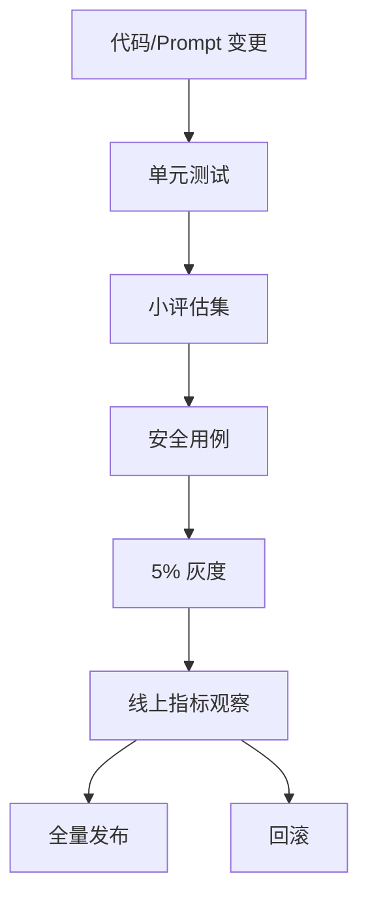

# 灰度发布、告警与事故复盘

大模型应用的发布对象不只有代码，还包括 Prompt、模型、RAG 索引、工具 Schema、评估集和安全策略。任何一个变化都可能改变线上行为。

## 版本对象

建议把这些都版本化：

1. `prompt_version`
2. `model_alias`
3. `retriever_version`
4. `knowledge_base_version`
5. `tool_schema_version`
6. `guardrail_version`
7. `eval_set_version`

灰度时，日志必须能看出用户命中了哪个组合。

## 发布门禁

一个实用门禁可以长这样：



门禁要同时看质量和运营指标：

1. 评估通过率不能下降超过阈值。
2. 高危安全用例不能失败。
3. P95 延迟不能明显变差。
4. 单请求成本不能失控。
5. 用户负反馈不能异常升高。

## 告警设计

不要对所有指标都设置很敏感的告警，否则很快没人看。建议先设置：

| 告警 | 触发 |
| --- | --- |
| 成本告警 | 小时/日预算超过阈值 |
| 错误率告警 | 5xx、超时、供应商错误升高 |
| 延迟告警 | P95/P99 超阈值 |
| 安全告警 | 敏感信息、越权工具调用 |
| 质量告警 | 线上负反馈突然升高 |

## 告警阈值例子

第一版阈值可以先保守、可解释：

| 告警 | 示例阈值 | 处理动作 |
| --- | --- | --- |
| 首 token 延迟 | `first_delta_latency_p95 > 3s` 持续 10 分钟 | 检查模型路由、检索耗时和供应商状态 |
| 总耗时 | `total_latency_p95 > 12s` 持续 10 分钟 | 降低 Top-K、限制输出长度或转后台任务 |
| 错误率 | `error_rate > 3%` 持续 5 分钟 | 打开降级或回滚最近版本 |
| 单次成本 | `avg_cost_per_request` 比基线升高 30% | 暂停灰度并检查上下文长度 |
| 引用准确率 | 小评估集低于 90% | 阻止发布并回查检索索引 |
| 安全失败 | 任意高危用例失败 | 立即阻断发布 |

阈值不需要一次完美，但必须写清“谁收到告警、先看什么、何时回滚”。

## 事故复盘

复盘模板：

1. 发生了什么。
2. 影响了哪些用户和场景。
3. 哪个版本引入问题。
4. 为什么评估或灰度没有拦住。
5. 如何修复。
6. 增加哪些评估用例或监控。
7. 下次如何更早发现。

LLMOps 的成熟度不在于永远不出错，而在于出错后能快速定位、回滚、修复，并把经验沉淀成评估和监控。

## 事故复盘样例

```text
事故：Android 知识库助手 P95 首 token 延迟从 1.8s 升到 5.6s
时间：2026-07-10 10:10 到 10:45
影响：崩溃分析场景约 18% 请求被用户取消
引入版本：prompt_v12 + retriever_v7 灰度 20%
直接原因：新 Prompt 要求返回更长分析，检索 Top-K 从 4 提到 10
为什么门禁没拦住：评估集只看总耗时均值，没有看首 token P95
修复动作：回滚 retriever_v7，Top-K 恢复为 4，长日志转后台任务
新增防线：评估报告增加首 token P95；监控增加 cancel_rate 与 latency 联动告警
剩余风险：复杂 Agent 场景仍可能超过 12s，需要单独后台任务策略
```

复盘最后一定要落到可验证资产：新增评估用例、告警规则、限流策略或回滚脚本。否则同类事故还会以另一个版本号再出现。
