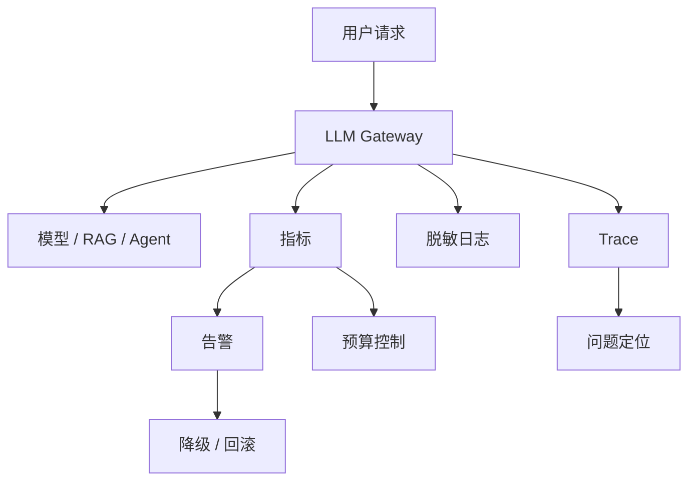

# 阶段十五：LLMOps：上线后的运维

本阶段目标是学习大模型应用上线后的监控、告警、成本、延迟、质量、灰度和回滚。LLMOps 不只是“模型运维”，而是把模型、Prompt、RAG、Agent、工具、Android 客户端和后端网关一起纳入可观测、可治理、可回滚的生产系统。

## 本阶段你会学到什么

1. 大模型应用上线后需要监控哪些指标。
2. 如何同时看质量、成本、延迟、错误率和用户反馈。
3. 如何设计 Prompt/RAG/模型版本的灰度发布。
4. 如何做限流、预算、熔断、降级和回滚。
5. 如何把评估结果和线上指标组合成发布门禁。
6. 如何运行一个离线 LLMOps 监控 Demo。

## 章节目录

1. [可观测性、日志与 Trace](./01-可观测性日志与Trace.md)
2. [成本、延迟、限流与降级](./02-成本延迟限流与降级.md)
3. [灰度发布、告警与事故复盘](./03-灰度发布告警与事故复盘.md)
4. [Demo：离线 LLMOps 监控](./04-Demo-离线LLMOps监控.md)

## 核心流程图

## 核心指标

| 维度 | 指标 |
| --- | --- |
| 质量 | 评估通过率、人工满意度、拒答准确率 |
| 成本 | token、请求成本、单用户成本、单任务成本 |
| 延迟 | 首 token 延迟、总耗时、P95/P99 |
| 稳定性 | 错误率、超时率、重试率、供应商失败率 |
| 安全 | 拦截率、越权工具调用、敏感信息泄露 |
| 业务 | 转化率、任务完成率、人工接管率 |

## 本阶段练习

为 Android 知识库助手设计一个上线监控表，包含请求量、首 token 延迟、总耗时、错误率、取消率、引用准确率、单次成本、降级次数和安全拦截率，并写一份“P95 延迟升高”的事故复盘。练习产物可以放到 [阶段练习与自检](../阶段练习与自检.md) 对应阶段下继续扩展。

## 和贯穿项目的关系

贯穿项目上线后，问题不再只来自代码，也可能来自 Prompt、模型、知识库、供应商、限流和用户输入变化。本阶段把这些变化都纳入指标、告警、灰度和回滚。

## 学完后的自检问题

1. 我能不能从指标看出是模型变慢、检索变慢还是前端渲染变慢？
2. 我能不能为成本、延迟、错误率和质量分别设置可执行告警阈值？
3. 我能不能写出事故时间线，并把复盘结论沉淀成评估用例或监控规则？

## 官方资料

- [Production best practices](https://developers.openai.com/api/docs/guides/production-best-practices)
- [API deployment checklist](https://developers.openai.com/api/docs/guides/deployment-checklist)
- [Latency optimization](https://developers.openai.com/api/docs/guides/latency-optimization)
- [Cost optimization](https://developers.openai.com/api/docs/guides/cost-optimization)
- [Rate limits](https://developers.openai.com/api/docs/guides/rate-limits)
