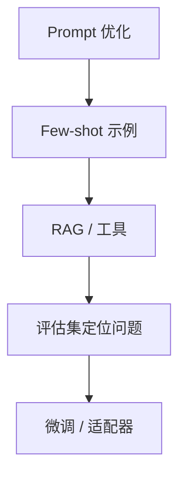

# 什么时候不该微调

微调不是大模型应用的默认解法。它成本高、周期长、排查困难，而且很容易把错误样例、过期知识和隐含偏见固化进模型。

## 优先不用微调的情况

| 场景 | 更合适的方法 |
| --- | --- |
| 需要最新政策、文档、数据库 | RAG 或工具查询 |
| 输出 JSON 不稳定 | JSON Schema / 结构化输出 |
| 少量风格问题 | Prompt + few-shot |
| 回答缺少上下文 | 检索、用户画像、业务状态 |
| 工具调用错 | 工具描述、权限、Trace 评估 |
| 事实经常变化 | 不要训练进模型 |

一个实用判断：如果答案依赖“今天数据库里的状态”，就不要微调；如果答案依赖“稳定风格或稳定决策模式”，才可能考虑微调。

## 定制手段阶梯

不要跳过前面的步骤。很多“模型不懂业务”的问题，本质是没有给它业务上下文。

## 适合微调的信号

1. 任务稳定，输入输出形态长期不变。
2. 已经有高质量示例。
3. 有明确评估指标。
4. Prompt 已经过长或 few-shot 太多。
5. 需要稳定语气、格式、分类或转换能力。
6. 错误不是因为缺少实时知识。

## 不适合微调的信号

1. 需求还在快速变化。
2. 没有可验证的训练数据。
3. 希望模型记住大量业务文档。
4. 安全边界不清晰。
5. 只是想“让模型更聪明”。
6. 没有评估集，无法证明变好了。

## Android 场景举例

适合：

1. 把用户口语命令稳定转成 App 内动作意图。
2. 将客服文本统一改写成品牌语气。
3. 固定类别的内容审核或标签分类。

不适合：

1. 让模型记住用户当前订单状态。
2. 让模型记住最新活动规则。
3. 让模型直接学习 App 数据库权限。

这些应该放在后端工具、RAG 或权限系统里。
